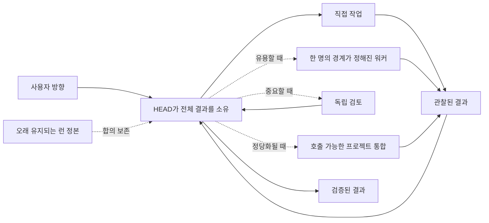

# 도입: 작업에 필요한 것만 사용하기

[HEAD Agent Core](../../README.md) / [학습](../README.md) / 도입

## 학습 목표

HEAD 모델이 한 작업에 맞는지 판단하고, 가장 작은 유용한 형태를 도입하며, 중요한 방향에 대한 인간의 통제를 유지하는 법을 배웁니다.

## 핵심 주장

HEAD는 작업을 하나의 대화에 담기 어려워질 때 책임, 근거, 연속성을 보존하는 방법입니다. 필수 의식도, 자율 조직도, 올바른 판단의 보장도 아닙니다.

## 챕터 지도

1. [HEAD가 필요한 때](when-you-need-head.md)
2. [최소 도입](minimal-adoption.md)
3. [공유 계층과 프로젝트 계층 분리](separating-shared-and-project.md)
4. [성숙도 수준](maturity-levels.md)
5. [흔한 안티패턴](common-antipatterns.md)
6. [보안 및 공개 경계](security-and-publication-boundaries.md)
7. [한계](limitations.md)

## 읽기 위치

이전: [진화: 근거가 무엇을 바꾸었는가](../10-evolution/README.md) | 다음: [HEAD가 필요한 때](when-you-need-head.md)

챕터를 나갈 때는 [학습](../README.md) 또는 [HEAD Agent Core 루트](../../README.md)로 돌아가세요. 현재 구현 계약은 [Shared Core](../../../head/README.md) (영문), [Shared Skills](../../../skills/README.md) (영문), [Shared MCP](../../../mcp/README.md) (영문), [Shared Agents](../../../agents/README.md) (영문), [Project Layer](../../../projects/README.md) (영문) 참조를 사용하세요.

출처 분류: 현재 공유 원칙; 현재 공개 참조 계약; 운영 관찰.
