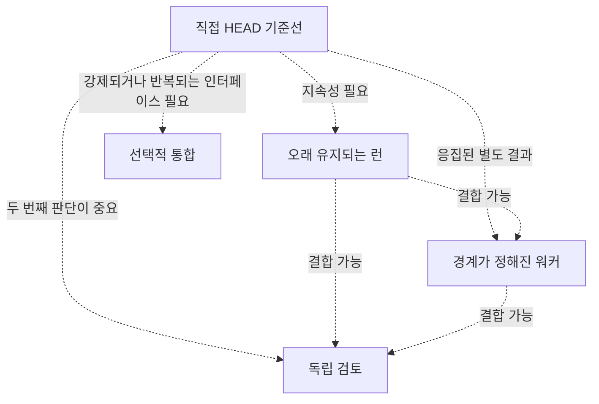

# 성숙도 수준

[HEAD Agent Core](../../../README.md) (영문) / [Learn](../../../learn/README.md) (영문) / [도입](README.md) / 성숙도 수준

## 학습 목표

더 큰 아키텍처를 졸업 요건으로 취급하지 말고, 관찰된 작업이 실제 필요를 만들 때만 역량을 늘립니다.

## 핵심 주장

성숙도는 실제 존재하는 복잡성에서 올바른 책임과 근거를 보존하는 능력입니다. 수준은 의무 순서가 아니라 선택적 추가입니다.

| 수준 | 추가할 때 | 역량 | 비용 및 주의 |
| --- | --- | --- | --- |
| 1. 직접 HEAD | 결과가 작고 즉시 확인 가능할 때 | 한 소유자가 이해하고 행동하고 검증 | 형식만을 위해 런이나 워커를 만들지 않는다. |
| 2. 오래 유지되는 런 | 작업이 멈추거나 여러 결과에 걸치거나 인계가 필요할 때 | 안정적인 사용자-HEAD 합의와 체크리스트가 중단을 견딤 | 합의를 권위 있게 유지하고 요약이 재정의하지 않게 한다. |
| 3. 경계가 정해진 워커 | 별도 소유자가 응집되고 관찰 가능한 결과를 만들 수 있을 때 | 경계가 정해진 컨텍스트와 HEAD 통합을 갖춘 표적 위임 | 배정에는 설정과 검토 비용이 든다. 연결되지 않은 작업 목록을 피한다. |
| 4. 독립 검토 | 별도 판단이 중요한 결과를 실질적으로 바꿀 수 있을 때 | 결론 또는 행동 전 근거 기반 반박 | 검토는 자동 승인 도장이 아니며 결정 소유권을 이전하지 않는다. |
| 5. 선택적 통합 | 반복 작업에 호출 가능 인터페이스나 강제된 안전 경계가 필요할 때 | 정의된 인가 및 운영 계약을 갖춘 필요 시 도구 | 이용 가능성은 정당화가 아니다. 도구에는 정책, 근거, 주의가 필요하다. |

## 관계 모델

## 설계 대응

현재 공유 모델은 계획 절차, 조정 인터페이스, 재사용 역할을 구별합니다. 이 분리는 프로젝트가 모든 선택적 메커니즘을 물려받지 않고 직접 HEAD 작업을 도입하게 합니다.

## 흔한 오해

“수준 5가 수준 1보다 낫다.” 적절한 수준은 작업을 이해 가능하고, 복구 가능하고, 검증 가능하게 하는 가장 덜 복잡한 수준입니다.

## 요점

입증된 하나의 조정, 연속성, 검토 또는 인터페이스 필요에 대응해 하나의 역량을 추가하세요.

이전: [공유 계층과 프로젝트 계층 분리](separating-shared-and-project.md) | 다음: [흔한 안티패턴](common-antipatterns.md)

출처 분류: 현재 공유 원칙; 현재 공개 참조 계약; 운영 관찰.
