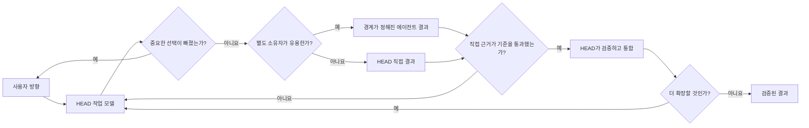
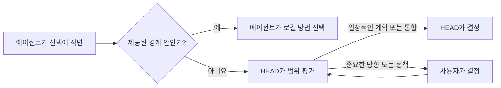
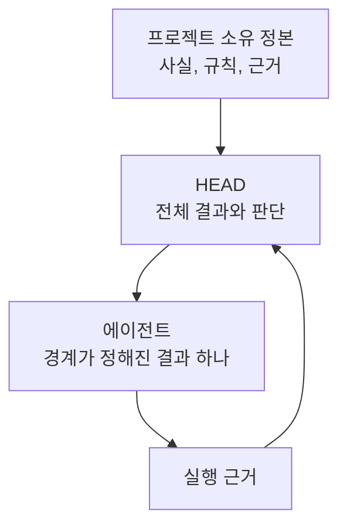
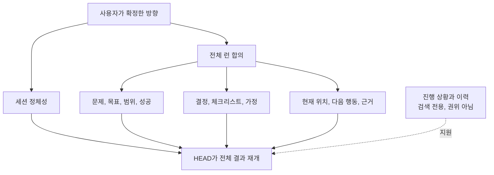
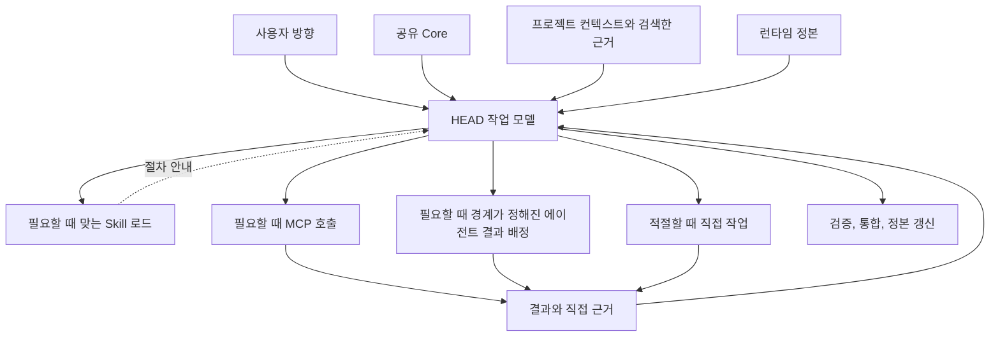

# 교육용 정본 다이어그램

[HEAD Agent Core](../README.md) / [교육](README.md) / 교육용 정본 다이어그램

이 다이어그램을 교육 경로의 단일 정본으로 사용하세요. Mermaid 소스를 경로나 슬라이드 노트에 복사하기보다 앵커가 있는 다이어그램에 링크하세요. 학습 페이지는 각 장에 맞는 설명 다이어그램을 제공합니다.

## 통제된 확장 루프

이 다이어그램으로 논지를 소개하세요. 일관된 한 단계를 확장하고, 무엇이 바뀌었는지 검증한 뒤에야 그 결과를 이후 작업의 입력으로 사용할 수 있게 합니다. 이는 관계 모델이지, 모든 작업에 에이전트나 형식적 게이트가 필요하다는 주장이 아닙니다.

학습 출처: [한 단계 확장 규칙](../learn/02-llm-problem/the-one-step-expansion-rule.md), [확장 전 검증](../learn/02-llm-problem/verification-before-expansion.md).

## 의사결정 권한 에스컬레이션

참가자가 능력 있는 에이전트와 의사결정 권한을 가진 의사결정자를 혼동할 때 사용하세요. 에이전트는 제공된 경계 안에서 승인 요청 없이 로컬 실행 선택을 하고, 경계를 넘는 선택은 에스컬레이션합니다. HEAD는 일상적인 계획과 통합을 책임지고, 사용자는 중요한 방향을 책임집니다.

학습 출처: [의사결정 권한](../learn/03-ownership/decision-rights.md).

## 오너십별 컨텍스트

이 다이어그램으로 컨텍스트 품질은 최대 양이 아니라 권위, 관련성, 시점, 오너십을 따른다는 점을 설명하세요. 프로젝트 정본은 변경 소유자에게 남습니다. HEAD는 전체 결과에 필요한 것을 구성하고, 에이전트는 자신의 결과에 필요한 가장 작은 완전한 컨텍스트를 받습니다.

학습 출처: [오너십별 컨텍스트](../learn/04-context/context-by-ownership.md), [더 많은 컨텍스트가 더 높은 지능은 아닌 이유](../learn/02-llm-problem/why-more-context-is-not-more-intelligence.md).

## 오래 유지되는 작업 합의

이 다이어그램으로 두 정본 복구 기록과 하위 검색 기록을 구분하세요. 세션 정체성은 안정적인 주제와 제약을 보존하고, 전체 런은 사용자-HEAD 작업 합의와 복구 상태를 보존합니다. 진행 상황과 이력은 검색을 지원할 수 있지만 어느 기록도 대체하거나 합의를 덮어쓸 수 없습니다.

학습 출처: [컨텍스트와 런](../learn/06-canon/context-and-run.md), [문제와 목표 고정하기](../learn/06-canon/fixing-the-problem-and-goal.md), [취약한 진행 상황과 이력](../learn/06-canon/fragile-progress-and-history.md).

## 구성 요소 조합

오너십 모델과 정본 모델 다음에 이 다이어그램을 사용하세요. 구성 요소를 사용할 수 있다고 해서 의사결정 권한이 부여되는 것은 아니며, 모든 요청에 모든 구성 요소가 필요한 것도 아닙니다.

학습 출처: [구성 요소가 함께 작동하는 방식](../learn/07-components/how-the-parts-compose.md).
