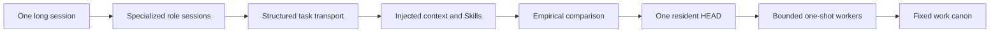

# Origin: How The System Grew

[HEAD Agent Core](../../README.md) / [Learn](../README.md) / Origin

## Learning Objective

Understand which practical failures pushed a single LLM workflow toward specialized roles, orchestration, selective context, bounded workers, and external work canon.

## Core Claim

The present system was not designed in one pass. Each layer began as a response to an observed failure. Some responses worked, some became excessive, and several were later removed when they created more coordination cost than value.

## Chapter Map

1. [From One Session To Many Roles](from-one-session-to-many-roles.md) explains the original context, specialization, and parallelism problems.
2. [What Kept Breaking](what-kept-breaking.md) follows the recurring operational failures behind the growing machinery.
3. [Failed Designs](failed-designs.md) examines mechanisms that solved one local problem but created a new system-level cost.
4. [Evolution Timeline](evolution-timeline.md) reconstructs the path from the first split to the current model.

## How To Read The History

The early system used more agents, more persistent state, stricter command formats, and more recovery logic than the current system. Those mechanisms should not be copied merely because they appear in the history. Their value is explanatory: they show what failed, what survived, and why simplification came after complexity rather than before it.

The current reference contracts begin at [Shared Core](../../head/README.md), not in the historical designs described here.

Next: [From One Session To Many Roles](from-one-session-to-many-roles.md)
