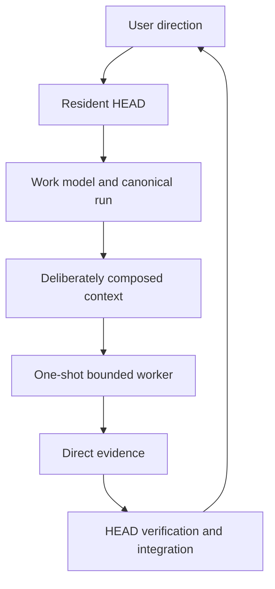

# Evolution Timeline

[HEAD Agent Core](../../README.md) / [Learn](../README.md) / [Origin](README.md) / Evolution Timeline

## Learning Objective

See the current architecture as the result of evidence-driven revisions rather than a fixed blueprint.

## Phase 1: One Conversation Did Everything

Research, planning, implementation, review, and documentation shared one growing context. This minimized setup but mixed roles, serialized independent work, and made long tasks fragile.

**Design response:** isolate specialized roles.

## Phase 2: Long-Lived Role Agents

Separate sessions handled research, planning, implementation, and validation. A HEAD coordinator assigned phases and combined artifacts.

**What improved:** context separation, domain focus, parallel work, phase-level retry.

**What appeared next:** transport errors, divergent context, worker monitoring, recovery complexity, and a growing agent roster.

## Phase 3: Structured Task Control

A task-control service replaced fragile free-form terminal commands. Plans, task packages, step files, state records, command validation, and phase gates made delegation inspectable.

**What improved:** command delivery, progress visibility, reproducibility, and automatic validation hooks.

**What appeared next:** schema ceremony, mechanism-first planning, and pressure to represent every task as the same sequence.

## Phase 4: Explicit Context Layers And Skills

Stable project context, session context, and role knowledge were injected automatically. Detailed workflows moved from the always-loaded prompt into on-demand Skills.

**What improved:** smaller role prompts, better retrieval pointers, and less repeated procedure text.

**What appeared next:** the belief that richer context and more tools would automatically produce better or cheaper work.

## Phase 5: Empirical Reframing

Comparisons between a richly equipped HEAD path and simpler agents challenged several assumptions.

The system did not consistently win by reading code more cheaply. Modern models could often search a local codebase effectively without elaborate context infrastructure. Richer tooling also cost more when it triggered broad investigation.

The durable advantages appeared elsewhere:

- evidence outside the codebase;
- connecting user language to implementation evidence;
- detecting conflicts between documentation and current behavior;
- verifying claims against live or primary sources;
- preserving decision boundaries and review gates.

**Design response:** stop treating retrieval technology as the protagonist. Treat evidence selection and verification behavior as HEAD responsibilities.

## Phase 6: Operational Simplification

The tool surface shrank. Read-heavy workflows moved behind on-demand procedures. The agent roster contracted. Resident workers became one-shot tasks. Detailed prohibitions were replaced with broader ownership and reasoning principles.

**What improved:** lower coordination overhead, clearer role boundaries, and fewer stale instructions.

**What appeared next:** long work could still be corrupted when compaction or generated progress displaced the original agreement.

## Phase 7: Fixed Work Canon

The recovery model was reduced to two fixed session files: stable session identity and the full user-HEAD work agreement. Progress and history remained available for retrieval but lost the authority to redefine the task.

**Current model:**

## What Changed Conceptually

| Earlier emphasis | Current emphasis |
| --- | --- |
| More specialized agents | Fewer agents with coherent outcome ownership |
| More detailed command constraints | Generative principles plus observable result contracts |
| More automatically loaded context | Small indexes plus deliberate retrieval |
| Recovery by generated current state | Recovery from the fixed user-HEAD agreement |
| Maximum automation | Controlled expansion with verification gates |
| Tool availability | Evidence selection and correct tool use |

## Evidence Boundary

The sequence above is supported by historical repository documents, commits, archived briefing scripts, runtime tests, and recorded operational failures. The interpretation that the system converged on control-plane, bounded-context, and least-authority ideas is retrospective and will be developed in later chapters.

## Takeaway

The current architecture is smaller than several of its predecessors, but it is not less structured. It concentrates structure in ownership, context selection, canon, and verification rather than in agent count and task machinery.

Next: [The LLM Problem Model](../02-llm-problem/README.md)

Source class: historical record and current architecture contracts.
