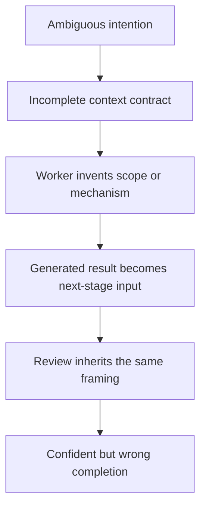

# What Kept Breaking

[HEAD Agent Core](../../README.md) / [Learn](../README.md) / [Origin](README.md) / What Kept Breaking

## Learning Objective

Recognize the recurring failure classes that caused the system to accumulate transport, context, recovery, and verification machinery.

## Core Claim

The system did not become elaborate because orchestration was the original goal. It became elaborate because reliable long-running work repeatedly failed at the boundaries between intention, context, execution, and recovery.

## 1. Commands Did Not Arrive As Intended

The first worker commands were sent through terminal automation. Long instructions crossed quoting, escaping, line-break, and pane-selection boundaries. A command could be truncated, interpreted by a shell, delivered to the wrong target, or accepted without enough information to act safely.

The response was structured task transport. Commands became persisted artifacts with validation and explicit destinations. This was the beginning of the shared task-control interface.

The lesson was larger than terminal reliability:

> A delegation boundary needs an observable contract, not an assumption that natural-language intent survived transport.

## 2. Broad Instructions Produced Broad Exploration

When a worker received "analyze this" or "fix the problem," it had to invent the relevant scope. It often read large files, captured oversized tool outputs, or explored unrelated areas before it could decide what mattered.

This consumed context and made the final reasoning harder to audit. The response was increasingly detailed task packaging, explicit outputs, and strict command schemas.

That improved consistency, but excessive detail later became its own problem: HEAD could accidentally prescribe an unverified implementation instead of defining the intended result.

## 3. Long Work Lost Its Shape

Large work was divided into many steps. Early steps might follow the intended methodology, while later steps drifted after context compression or repeated handoffs. A list of completed steps could look healthy even when the original outcome had changed.

The system added progress files, task state, recovery commands, active pointers, and phase verification. Each mechanism attempted to answer one question: "What exactly are we doing, and what should happen next?"

The eventual lesson was that current position is not enough. Recovery also needs the original problem, goal, scope, decisions, and success conditions.

## 4. Context Compression Changed The Effective Task

Compaction produces a lossy representation of a long conversation. In early designs, a generated recovery message or current-state file was treated as sufficient authority. This worked when the summary preserved the right details and failed badly when it did not.

A dangerous failure mode emerged:

```text
partial result
    -> compressed as overall completion
    -> loaded as the new task state
    -> verified against the reduced scope
    -> reported as correct
```

The later validator could be internally consistent and still validate the wrong objective. The error was not merely missing information. A lossy derivative had displaced the user-HEAD agreement.

## 5. More Tools Did Not Guarantee Better Work

Adding retrieval systems, browser tools, databases, and specialist interfaces increased what a model could do. It did not guarantee that the model would select the right tool, use it deeply enough, or distinguish direct evidence from convenient documentation.

Operational comparisons showed that a simpler agent could sometimes solve code-local work faster. The richer HEAD configuration was most valuable when the task required evidence outside code, cross-source verification, user-language interpretation, or durable decisions.

This changed the question from "How many tools can we provide?" to "Which capabilities change this outcome, and who should own their use?"

## 6. Review Could Repeat The Same Error

A review is not independent merely because it has a different label. If the reviewer inherits the same narrowed scope, stale assumption, or unsupported diagnosis, it can confidently approve the same mistake.

The system therefore separated several concerns:

- workers verify their local result;
- HEAD verifies how the result composes into the original outcome;
- an independent validator is added only when separate judgment can materially change the result;
- the user retains final authority over material direction and risk.

## Failure Pattern



The present design breaks this chain at several points: user-owned decisions, HEAD-owned work modeling, bounded worker ownership, direct evidence, and canonical recovery.

## Takeaway

Most failures occurred at transitions, not inside a single model response. Reliable orchestration therefore depends less on adding intelligence and more on preserving meaning across boundaries.

Next: [Failed Designs](failed-designs.md)

Source class: historical repository records, archived briefing material, runtime incidents, and generalized failure stories.
