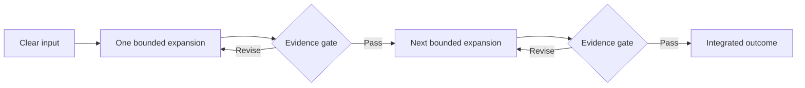

# The LLM Problem Model

[HEAD Agent Core](../../README.md) / [Learn](../README.md) / The LLM Problem Model

## Learning Objective

Understand the operational assumptions about LLM behavior that motivate controlled expansion, selective context, explicit ownership, and verification gates.

## Core Claim

The architecture does not assume that LLMs are incapable of complex work. It assumes that generated work becomes risky when its context, authority, and verification status are not preserved across multiple transformations.

## Five Ideas

1. [Context Is Not Memory](context-is-not-memory.md) introduces the actor-rereading-a-script analogy and its limits.
2. [The One-Step Expansion Rule](the-one-step-expansion-rule.md) explains why a bounded elaboration can be useful while unchecked recursive expansion is dangerous.
3. [Error Compounds Downstream](error-compounds-downstream.md) shows how omissions and assumptions become inherited premises.
4. [Verification Before Expansion](verification-before-expansion.md) defines the evidence gate between generated stages.
5. [Why More Context Is Not More Intelligence](why-more-context-is-not-more-intelligence.md) replaces context volume with authority, relevance, timing, and ownership.

## Status Of The Model

This is an operating model, not a complete scientific theory of language models. It summarizes repeatable failure patterns that informed the system. Later chapters connect those patterns to established ideas in hierarchical planning, information boundaries, least authority, and separation of duties.

Next: [Context Is Not Memory](context-is-not-memory.md)
