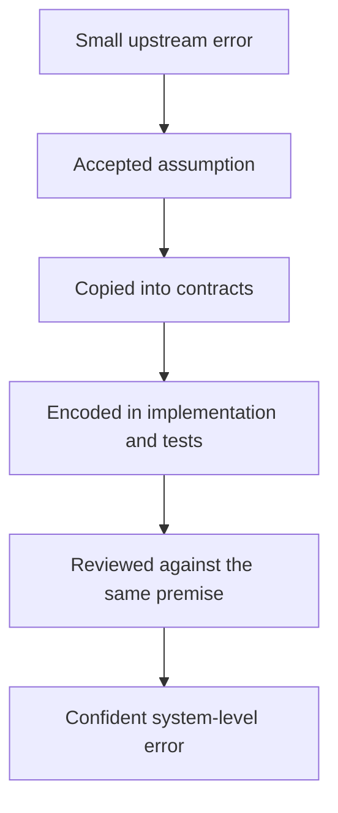

# Error Compounds Downstream

[HEAD Agent Core](../../README.md) / [Learn](../README.md) / [The LLM Problem Model](README.md) / Error Compounds Downstream

## Learning Objective

See why a small unverified error near the top of a workflow can be more dangerous than a visible implementation defect near the bottom.

## Four Forms Of Upstream Error

### Omission

A requirement, exception, or user decision is absent from the representation passed forward.

### Guess

The model fills a missing fact with a plausible assumption and does not mark it as unverified.

### Scope Drift

A partial result, convenient subproblem, or recent artifact replaces the full intended outcome.

### Authority Drift

A summary, worker report, old document, or runtime state is treated as if it could override the user or the canonical source.

## How Compounding Happens

Consider a generic software workflow:

```text
User asks for a behavior
    -> plan omits one boundary case
    -> specification treats omission as intentional
    -> implementation has no branch for the case
    -> tests are generated from the same specification
    -> review confirms that implementation matches specification
```

Every downstream artifact is internally consistent. The system has not become more correct; it has made the original omission harder to see.



## Why Review Alone Is Not Enough

A reviewer can catch local defects while missing a corrupted target. If the review question is "Does the artifact satisfy this specification?" and the specification already lost the user's requirement, a clean review may strengthen the wrong conclusion.

Independent review earns its name only when it can reach the governing requirement and primary evidence, not merely the latest derivative artifact.

## The Cost Of Late Discovery

An implementation defect may require one code change. An upstream framing defect may invalidate planning, interfaces, tests, documentation, and release decisions at once.

That is why HEAD invests more attention at decision boundaries than at every local action. The goal is not to eliminate all mistakes. It is to detect high-leverage mistakes before they become infrastructure for later work.

## Error Containment By Ownership

The User-HEAD-Agent hierarchy limits how far an unchecked conclusion can travel:

| Layer | Can decide | Must not silently decide |
| --- | --- | --- |
| User | Material direction, policy, risk, and final priorities | Local implementation details that have one reasonable answer |
| HEAD | Work model, context selection, sequencing, integration | New material direction not granted by the user |
| Worker | Local execution choices inside one outcome | Parent scope, policy, or the meaning of success |

If a worker discovers evidence that challenges the parent framing, the correct action is not to hide the conflict or invent policy. It returns the evidence so HEAD can update the work model or request a user decision.

## Generalized Failure

A worker found a real defect in code and proposed it as the cause of a reported problem. The diagnosis was plausible and technically valid. Direct evidence later showed that the affected case never traversed that defect. The worker had solved a nearby problem, not the user's problem.

The lesson was not "workers should never investigate." It was that a local diagnosis must be integrated with the evidence that identifies the actual case.

## Takeaway

The most dangerous error is often not a wrong line of code. It is an unchecked premise that several correct-looking stages inherit.

Next: [Verification Before Expansion](verification-before-expansion.md)

Source class: generalized operational failures and current authority model.
