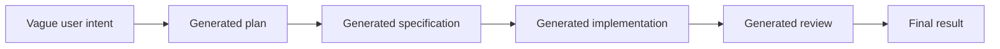
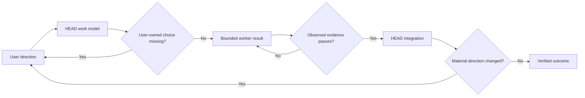

# The One-Step Expansion Rule

[HEAD Agent Core](../../README.md) / [Learn](../README.md) / [The LLM Problem Model](README.md) / The One-Step Expansion Rule

## Learning Objective

Understand why HEAD treats generation as a sequence of bounded, verified expansions instead of one autonomous chain from vague intention to final outcome.

## Core Claim

An LLM is often effective at elaborating one clear input into the next useful representation. Risk rises when that generated representation is accepted without verification and becomes the premise for several more transformations.

I summarize this as the one-step expansion rule:

> Expand one coherent step, verify what changed, and only then use the result as input to the next step.

This is an operating rule, not a claim that every task must contain one tool call or that a model cannot perform several internal reasoning steps. "One step" means one ownership boundary with one independently observable result.

## What Counts As An Expansion

Expansion changes the level or specificity of the work:

```text
direction
    -> work model
    -> bounded task contract
    -> implementation or artifact
    -> integrated outcome
```

Each arrow introduces detail that was not fully present before. The new detail may be correct, but it may also contain omissions, guesses, or choices that belong to another owner.

## Why Low-Level Work Can Be Strong

The rule is not based on the belief that LLMs are weak at implementation. A worker can be very effective when it receives:

- a clear result to produce;
- the relevant starting evidence;
- locked decisions and boundaries;
- authority over ordinary local choices;
- a direct way to verify completion.

Within that bounded space, the worker can diagnose, implement, and test without asking HEAD to dictate every line.

## Where Quality Falls

Problems appear when the system silently chains generated assumptions:



If no stage checks the previous output against the user, primary evidence, or observed behavior, the chain becomes self-referential. A plausible assumption in the plan becomes a requirement in the specification, an interface in the implementation, and a pass condition in the review.

## Controlled Expansion

HEAD inserts ownership and evidence gates:



The gate is not always a human meeting. It can be a test, diff, screenshot, query, schema validation, source comparison, or direct inspection. What matters is that the next expansion consumes a checked result rather than an unchecked story.

## Small Work Still Stays Small

A local, reversible, immediately verifiable task may collapse to inspect, act, and verify within HEAD or one worker. The rule does not require ceremonial decomposition. It requires that the owner can observe whether the result is actually correct before the result influences broader work.

## Common Misunderstanding

The rule does not prohibit autonomy. It creates a safe area for autonomy. A worker with one coherent outcome should make ordinary technical decisions without constant approval. What it may not do is expand its local result into new product policy, architecture, or scope.

## Takeaway

The useful unit of LLM autonomy is not an unlimited chain of tasks. It is a bounded outcome whose inputs, authority, and completion evidence are clear enough to verify before further expansion.

Next: [Error Compounds Downstream](error-compounds-downstream.md)

Source class: operational observation and archived teaching model.
