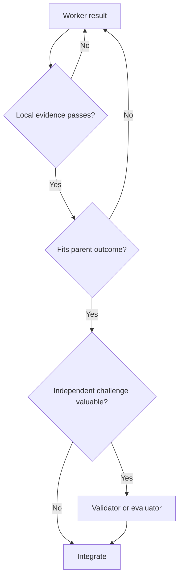

# Verification Before Expansion

[HEAD Agent Core](../../README.md) / [Learn](../README.md) / [The LLM Problem Model](README.md) / Verification Before Expansion

## Learning Objective

Define what it means to verify a generated result before it becomes authoritative input to later work.

## Draft Until Checked

In this system, an LLM-generated statement, plan, implementation, or review is a draft until it is checked against observable evidence appropriate to the claim.

Confidence, detail, and professional tone are not evidence. A worker saying "all tests pass" is weaker than the test output. A plan saying "the system uses this interface" is weaker than the current source or contract. A summary saying "the work is complete" is weaker than the original success conditions and checklist.

## Match Evidence To The Claim

| Claim | Useful direct evidence |
| --- | --- |
| Code behaves as intended | Focused test, reproducible command, runtime observation |
| A UI is visually correct | Rendered screenshot at the required viewport |
| A file changed as intended | Diff and targeted content inspection |
| An external fact is current | Primary source or live read-only query |
| A document follows a contract | Schema, link, coverage, and source checks |
| A delegated result is complete | Artifact inspection plus outcome-level acceptance evidence |
| The whole task is complete | Original run scope, success conditions, and completed checklist |

## Three Verification Levels

### Worker Self-Check

The worker verifies the result it owns. A developer runs the focused test. A writer validates the required structure. A designer inspects the rendered output. This keeps diagnosis, execution, and direct local evidence together.

### HEAD Integration Check

HEAD verifies that the local result satisfies the parent outcome, respects locked decisions, and composes with dependencies. This is where a technically correct local result may still be rejected as irrelevant or incomplete.

### Independent Challenge

A separate validator or evaluator is useful when a different perspective can materially change a consequential result. Independence is not mandatory ceremony. It is a tool for decisions where correlated reasoning is a meaningful risk.

## Verification Is A Boundary, Not A Phase Name

A rigid workflow may create a step called "validation" and still fail to validate the right thing. The evidence gate belongs wherever one representation becomes the trusted input for another.

For a small change, verification may happen seconds after editing. For a large plan, it may happen before any implementation. For recovered work, it begins by checking that the loaded target is still the user-approved target.

## Verification Can Change The Model

Evidence does not merely approve or reject execution. It can reveal that the plan, diagnosis, or system model was wrong. When that happens, HEAD should update the model rather than force the requested mechanism.

This is why outcome-oriented delegation is important. A worker can challenge an incorrect local hypothesis while still respecting the parent product and policy boundary.

## Common Misunderstanding

Verification is not equivalent to distrust of workers, nor does it require the user to inspect every low-level artifact. The hierarchy exists so evidence can be checked at the right abstraction level: the worker checks local behavior, HEAD checks composition, and the user checks material direction.

## Takeaway

Do not let generated output become infrastructure for later work merely because it looks complete. Match the claim to observable evidence, then allow the next expansion.

Next: [Why More Context Is Not More Intelligence](why-more-context-is-not-more-intelligence.md)

Source class: current completion contracts and operational verification practice.
