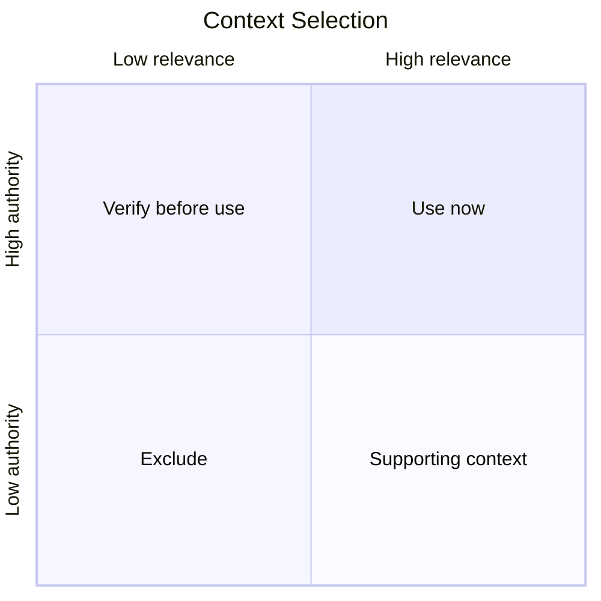

# Why More Context Is Not More Intelligence

[HEAD Agent Core](../../README.md) / [Learn](../README.md) / [The LLM Problem Model](README.md) / Why More Context Is Not More Intelligence

## Learning Objective

Replace the instinct to maximize prompt volume with a model for selecting the smallest complete, authoritative working set.

## The Context-Dump Instinct

When an LLM lacks a fact, the obvious response is to give it more information. As projects grow, this can become a default strategy: add the full repository guide, every related document, all recent history, tool output, and prior discussion "just in case."

This solves absence by creating a selection problem. The model must now determine which source is current, which detail is relevant, which conflict is intentional, and which role owns the decision.

More context expands possibility. It does not automatically improve judgment.

## Four Context Qualities

### Authority

Can this source define the answer, or is it a report, cache, summary, hypothesis, or historical artifact?

### Relevance

Does this information change the current decision or result? Useful project knowledge can still be irrelevant to one bounded task.

### Timing

Is the information needed now? Loading implementation details during high-level direction setting can anchor the plan too early. Loading policy only after implementation is too late.

### Ownership

Which actor needs this information to make its allowed decisions? HEAD may need broad cross-source context. A worker may need only the contract and target surface for one result.



The diagram is incomplete without timing and ownership, but it makes the first point visible: volume is not the selection rule.

## Smallest Complete Context

"Minimal context" can be misleading if it means withholding facts required for correct judgment. The target is the smallest complete context:

- small enough to avoid unrelated history and conflicting residue;
- complete enough to preserve purpose, locked decisions, relevant evidence, boundaries, and success conditions;
- explicit enough to distinguish verified facts from hypotheses;
- linked to sources that can be retrieved when deeper evidence is needed.

## Index, Then Retrieve

HEAD does not need every project fact in the always-loaded prompt. It needs a stable map of where authoritative information lives and procedures for retrieving the relevant source.

```text
small project index
    -> identify the authority for this question
    -> retrieve the relevant source
    -> inspect the necessary slice
    -> keep large raw output outside model context when possible
```

This design preserves breadth without carrying the full payload into every decision.

## Different Owners Need Different Context

| Owner | Context shape |
| --- | --- |
| User | Direction, trade-offs, risk, and final decision surface |
| HEAD | Whole outcome, authoritative pointers, dependencies, decisions, and integration evidence |
| Worker | One outcome, target evidence, locked decisions, local authority, and direct completion check |
| Validator | Governing requirements, artifact, primary evidence, and explicit review scope |

Giving every actor the same context is not neutrality. It erases the distinctions that make ownership useful.

## Common Misunderstanding

Selective context is not an excuse to keep workers ignorant or manipulate their conclusions. Missing a material constraint makes the brief incomplete. The goal is to remove irrelevant breadth while preserving every fact needed for the worker's legitimate decisions.

## Takeaway

The question is not "How much context can the model hold?" It is "Which authoritative information must this owner see at this decision boundary, and what can remain retrievable by reference?"

Next course chapter: Ownership, User, HEAD, and bounded Agents. That chapter is planned in the next documentation slice.

Return to [Learn HEAD](../README.md).

Source class: current context architecture and operational observations. External long-context research will be added during the English evidence pass.
