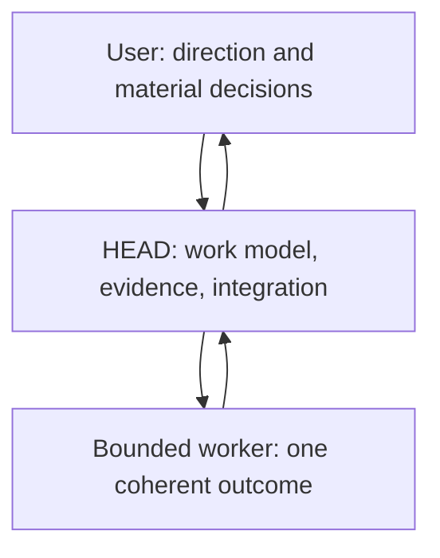

# Ownership: User, HEAD, And Bounded Agents

[HEAD Agent Core](../../README.md) / [Learn](../README.md) / Ownership

## Learning Objective

Understand why HEAD is the single conversational and integration surface, while workers receive bounded outcomes rather than becoming independent decision-makers.

## Core Claim

The architecture expands work downward without distributing ownership upward. The user sets direction, HEAD holds the whole work model, and a worker completes one bounded result within that model.

## Chapter Map

1. [User Talks Only To HEAD](user-talks-only-to-head.md) defines the single decision surface.
2. [High, Mid, And Low Abstraction](high-mid-low-abstraction.md) separates direction, work modeling, and execution.
3. [Decision Rights](decision-rights.md) identifies who may make which kind of choice.
4. [HEAD As Control Plane](head-as-control-plane.md) explains orchestration without turning it into detached management.
5. [Bounded Agent Ownership](bounded-agent-ownership.md) defines a worker's complete but limited responsibility.
6. [Verification And Integration](verification-and-integration.md) closes the loop before work becomes a trusted conclusion.

## Theory As Interpretation

The current ownership model was developed through operational practice. Hierarchical planning, abstraction levels, control-plane design, decision-rights design, bounded context, least authority, separation of duties, single responsibility, and dependency scheduling are **retrospective related-theory mappings**. They clarify the model; this course does not claim they were its original documented source.

Previous: [The LLM Problem Model](../02-llm-problem/README.md) | Next: [User Talks Only To HEAD](user-talks-only-to-head.md)

Source class: current ownership and delegation contracts; retrospective design-theory interpretation.
