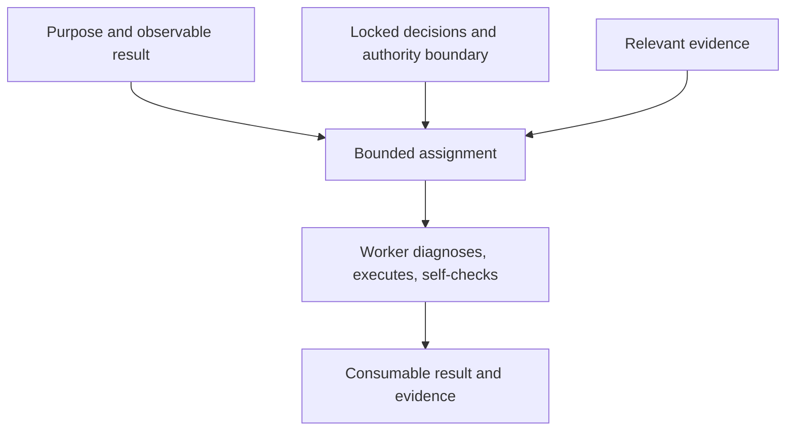

# Bounded Agent Ownership

[HEAD Agent Core](../../README.md) / [Learn](../README.md) / [Ownership](README.md) / Bounded Agent Ownership

## Learning Objective

Define a worker assignment as one coherent outcome with enough context and authority to complete it end to end.

## The Smallest Complete Assignment

A useful worker assignment gives one owner a result that can be observed independently. It includes the purpose, locked decisions, relevant evidence, permitted surface, and direct completion evidence. It does not substitute broad project discovery for HEAD's responsibility to establish the task boundary.

The boundary is small enough to avoid speculative work and complete enough to prevent invention. If a worker needs a material decision outside the boundary, it reports the evidence rather than silently extending its mandate.

## Why Outcomes, Not Step Lists

A detailed step list can be useful when a fixed protocol is itself required. Otherwise, it can lock in an unverified diagnosis and reward activity over the result. An outcome preserves room for the worker to choose a better local method while keeping the acceptance target visible.

## Retrospective Related Theory

**Related theory, retrospective:** this resembles bounded context, least authority, and single responsibility. The mapping is explanatory and does not claim these concepts were the documented original source of the practice.

## Common Misunderstanding

Bounded does not mean tiny. A worker may own a substantial result if its evidence, decisions, and mutation surface form one coherent unit.

## Takeaway

Delegate a complete result, not a pile of disconnected steps or the entire unresolved project.

Previous: [HEAD As Control Plane](head-as-control-plane.md) | Next: [Verification And Integration](verification-and-integration.md)

Source class: current delegation contracts and operational practice; retrospective design-theory interpretation.
