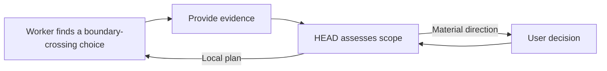

# Decision Rights

[HEAD Agent Core](../../README.md) / [Learn](../README.md) / [Ownership](README.md) / Decision Rights

## Learning Objective

Recognize which decisions belong to the user, HEAD, and a bounded worker, and what happens when a required decision is missing.

## Rights Follow Consequence And Scope

| Decision | Default owner | Why |
| --- | --- | --- |
| Product direction, policy, material architecture, workflow, risk, cost, or other material trade-off | User | These choices define what success is allowed to mean. |
| Planning, evidence selection, sequencing, and integration | HEAD | They require the whole outcome and its dependencies. |
| Local technical method within a locked boundary | Worker | It is closest to the target and direct completion evidence. |

This table is a default, not permission to infer absent policy. When a missing choice would change the product, material architecture or workflow, risk posture, or acceptance target, HEAD resolves it with the user rather than letting a worker invent it.

## A Useful Escalation

A worker can discover that a supplied assumption is wrong. It should provide the relevant evidence and stop at the authority boundary. HEAD then decides whether the issue is local, requires replanning, or is material enough to return to the user.

## Retrospective Related Theory

**Related theory, retrospective:** this maps to decision-rights design and separation of duties. The mapping explains why distinct authority boundaries reduce accidental policy invention; it does not establish an earlier theoretical design process.

## Common Misunderstanding

Decision rights are not a way to make every action wait for approval. They remove unnecessary approval by making local autonomy explicit where it is safe.

## Takeaway

Give each decision to the owner with the necessary context and legitimate authority, then escalate the rest visibly.

Previous: [High, Mid, And Low Abstraction](high-mid-low-abstraction.md) | Next: [HEAD As Control Plane](head-as-control-plane.md)

Source class: current ownership and delegation contracts; retrospective design-theory interpretation.
