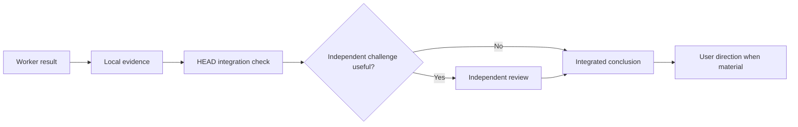

# Verification And Integration

[HEAD Agent Core](../../README.md) / [Learn](../README.md) / [Ownership](README.md) / Verification And Integration

## Learning Objective

Distinguish a worker's self-check from HEAD's outcome-level integration and an optional independent challenge.

## Completion Has More Than One Scope

A worker verifies the artifact and behavior it owns. HEAD then verifies that result against the parent outcome, locked decisions, and dependencies. An independent reviewer can challenge a consequential conclusion when a separate perspective could materially change it. The user retains final direction over material choices.

## Why Integration Is Separate

A locally correct result can still be incomplete, conflict with a dependency, or answer a superseded question. Conversely, an integration check should not pretend to replace the worker's direct evidence. Each check belongs at the abstraction level where it can observe the relevant failure.

## Retrospective Related Theory

**Related theory, retrospective:** this separation resembles separation of duties and layered assurance. It is a later explanatory mapping, not a claim about the original documented design source.

## Common Misunderstanding

Independent review is not mandatory ceremony. It is useful when correlated reasoning or the consequence of error justifies another evidence-bearing perspective.

## Takeaway

Trust should move upward only with evidence: local evidence for the result, integration evidence for the outcome, and user direction for material choices.

Previous: [Bounded Agent Ownership](bounded-agent-ownership.md) | Next: [Context](../04-context/README.md)

Source class: current completion and delegation contracts; retrospective design-theory interpretation.
