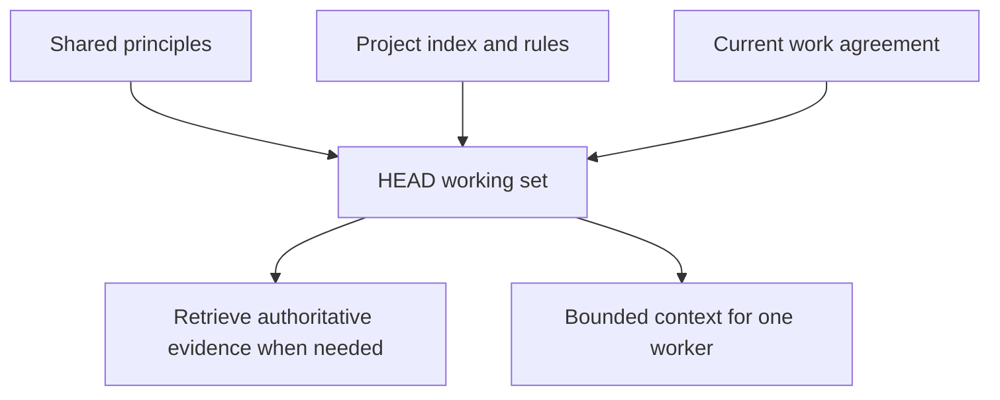

# Context: A Governed Working Set

[HEAD Agent Core](../../README.md) / [Learn](../README.md) / Context

## Learning Objective

Understand context as information selected for a specific owner and outcome, not as every fact that happens to be available.

## Core Claim

Context quality depends on four questions: is the information authoritative, relevant now, available at the right time, and owned by the right layer? More material cannot repair a missing answer to those questions.

## Chapter Map

1. [Context By Ownership](context-by-ownership.md) separates whole-project, outcome, and task context.
2. [Always Loaded Vs. Retrieved](always-loaded-vs-retrieved.md) distinguishes stable guidance from on-demand evidence.
3. [Index, Not Payload](index-not-payload.md) explains how an index routes judgment without impersonating authority.
4. [Shared Vs. Project Context](shared-vs-project-context.md) keeps portable principles separate from local facts.
5. [Context For HEAD](context-for-head.md) defines the breadth HEAD needs to judge and compose work.
6. [Context For Workers](context-for-workers.md) defines a complete but bounded assignment.
7. [Context Antipatterns](context-antipatterns.md) identifies common ways context loses its value.

## Takeaway

Compose the smallest authoritative working set that lets the current owner make the next sound decision.

Previous: [Ownership](../03-ownership/README.md) | Next: [Context By Ownership](context-by-ownership.md)

Source class: current shared Core principles and context-management architecture; operational design guidance.
