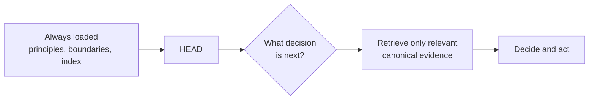

# Always Loaded Vs. Retrieved

[HEAD Agent Core](../../README.md) / [Learn](../README.md) / [Context](README.md) / Always Loaded Vs. Retrieved

## Learning Objective

Choose which information must be stable and automatic and which should be retrieved only for a concrete need.

## Stable Guidance, Timely Evidence

Always-loaded context should be small, durable, and broadly applicable: ownership principles, hard boundaries, and routes to authority. Detailed evidence should be retrieved when the active outcome makes it relevant. This preserves attention for the decision at hand and lets mutable facts be checked near the time of use.

## Design Response

Use a small stable base plus explicit retrieval. The rejected alternative is preloading every document that might someday matter. Preloading obscures relevance, carries stale copies forward, and makes a later fact difficult to trace to its source.

## Timing Matters

An authoritative document can still be wrong for the moment if it describes a changed external condition. Retrieval is not merely token economy; it is a chance to recheck mutable evidence before relying on it.

## Common Misunderstanding

Retrieved does not mean optional or weak. A high-consequence decision may require more evidence than an always-loaded rule; it simply does not belong in every unrelated working set.

## Takeaway

Load stable rules automatically. Retrieve detailed, mutable, or outcome-specific evidence when the work calls for it.

Previous: [Context By Ownership](context-by-ownership.md) | Next: [Index, Not Payload](index-not-payload.md)

Source class: current shared Core principles and context-management architecture; operational design guidance.
