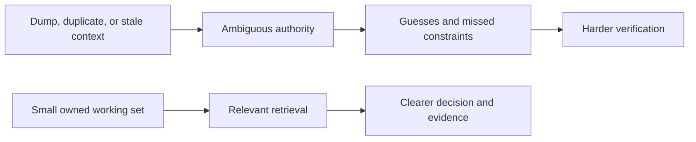

# Context Antipatterns

[HEAD Agent Core](../../README.md) / [Learn](../README.md) / [Context](README.md) / Context Antipatterns

## Learning Objective

Recognize patterns that make a working set large, stale, ambiguous, or detached from ownership.

## Failure Patterns

| Pattern | Why it fails | Better response |
| --- | --- | --- |
| Context dump | Volume hides the decision-relevant material. | Load stable guidance and retrieve evidence for the outcome. |
| Stale summary as authority | A compressed record can omit or change a constraint. | Return to the owned agreement and canonical source. |
| Duplicate policy | Copies drift and conceal which version governs. | Keep one owned source and point to it. |
| Unbounded discovery | A worker invents scope while trying to locate its task. | Let HEAD establish a bounded outcome and evidence set. |
| Copied history | Old activity consumes attention without changing the next decision. | Keep history retrievable by reference. |

## Generalized Failure

**Generalized failure:** after an interruption, a shortened handoff can appear to describe the work while omitting part of the original agreement. Work may then be completed and checked against the reduced description rather than the user's full goal. The failure is not that summaries are useless; it is treating a fragile retrieval aid as the governing source.

## Design Response

Use a canonical agreement for durable work, preserve history for retrieval, and explicitly retrieve detailed evidence when needed. The rejected alternative is adding more copied summaries and fallback records until one seems complete. More derived records increase ambiguity instead of restoring authority.

## Common Misunderstanding

The answer is not a minimal prompt in every situation. It is a deliberately composed working set whose contents can be traced to an owner and a current purpose.

## Takeaway

Remove context that cannot affect the current decision, and never let a convenient copy outrank its canonical source.

Previous: [Context For Workers](context-for-workers.md) | Next: [General Rules](../05-general-rules/README.md)

Source class: current context-management architecture and generalized operational failure; no project-specific incident details.
