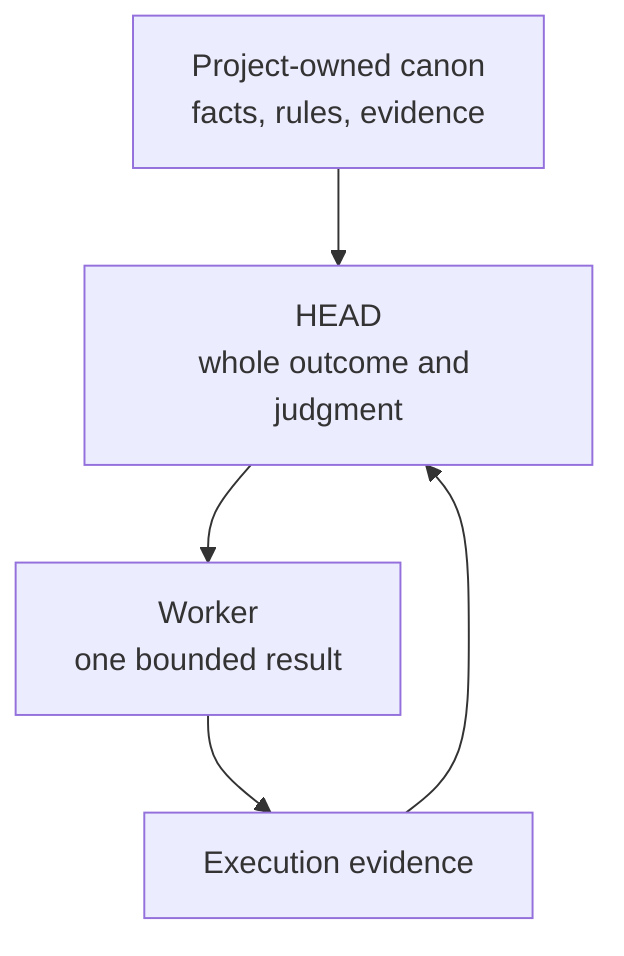

# Context By Ownership

[HEAD Agent Core](../../README.md) / [Learn](../README.md) / [Context](README.md) / Context By Ownership

## Learning Objective

Distinguish the context that belongs to a project, HEAD, and a bounded worker.

## Different Owners Need Different Context

A project owns its facts, policies, and canonical evidence. HEAD owns the whole work model: it needs enough breadth to interpret the request, select evidence, connect dependencies, and integrate results. A worker owns one coherent outcome and needs only the subset that makes that outcome executable.

Giving a worker all project context transfers discovery and policy interpretation that HEAD still owns. Giving HEAD only a task fragment prevents sound integration. The right boundary follows responsibility, not a fixed prompt size.

## Design Response

Keep canonical material with its change owner, give HEAD pointers and relevant evidence, then shape a worker brief around one observable result. The rejected alternative is a universal context bundle. It looks complete but makes authority unclear and increases stale or irrelevant material.

## Retrospective Related Theory

**Related theory, retrospective:** this resembles bounded context, least authority, and separation of duties. These concepts explain the design; they are not presented as its original documented source.

## Common Misunderstanding

Separate ownership does not mean information silos. HEAD can retrieve project evidence and pass the necessary part onward; it means each owner receives information for its actual decision rights.

## Takeaway

Context should expand and narrow with ownership: project canon, HEAD's work model, then a worker's bounded assignment.

Previous: [Context](README.md) | Next: [Always Loaded Vs. Retrieved](always-loaded-vs-retrieved.md)

Source class: current shared Core principles, delegation contract, and context-management architecture.
