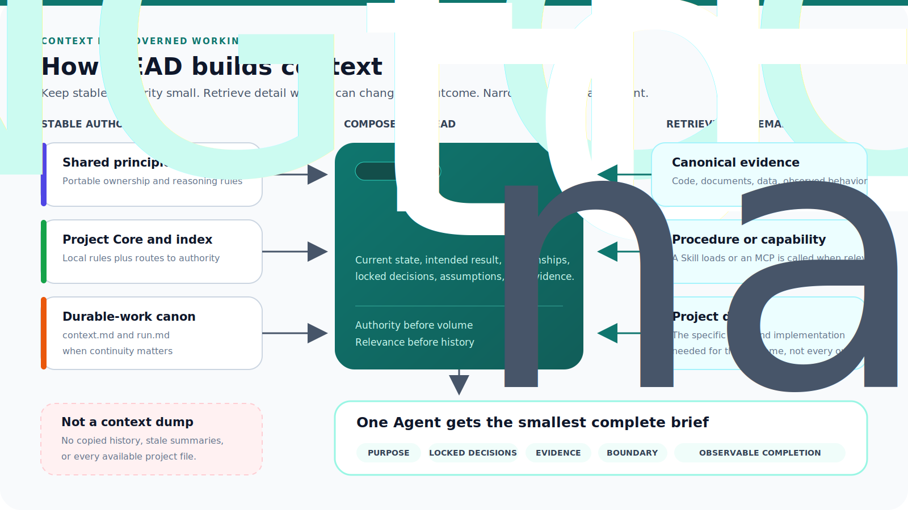

# Context For HEAD

[HEAD Agent Core](../../README.md) / [Learn](../README.md) / [Context](README.md) / Context For HEAD

## Learning Objective

Identify the context HEAD needs to judge, plan, dispatch, and integrate the whole outcome.

## Breadth For Judgment

HEAD owns understanding, execution strategy, context composition, integration, and conclusion. Its working set therefore needs the user's direction, applicable boundaries, current work agreement, dependency picture, and routes to relevant evidence. It does not need every project document at once.

## Design Response

HEAD composes enough breadth to evaluate relationships between results and decide what evidence to retrieve. The rejected alternative is treating HEAD as a message relay. A relay can forward a task, but cannot reliably resolve dependencies, preserve the agreement, or determine whether a worker result composes into it.

## Relevance And Timing

HEAD's context changes as the work changes. A source relevant to planning may be irrelevant to a narrow edit; a mutable fact may need rechecking before integration. The stable work agreement anchors this changing working set without replacing retrieval with memory.

## Common Misunderstanding

Whole-outcome ownership does not require omniscience. It requires responsibility for finding and judging the needed evidence before a decision is made.

## Takeaway

Give HEAD the agreement, boundaries, relationships, and evidence routes needed to own the whole result, then retrieve the detail that changes the next judgment.

Previous: [Shared Vs. Project Context](shared-vs-project-context.md) | Next: [Context For Workers](context-for-workers.md)

Source class: current shared Core principles and context-management architecture.
