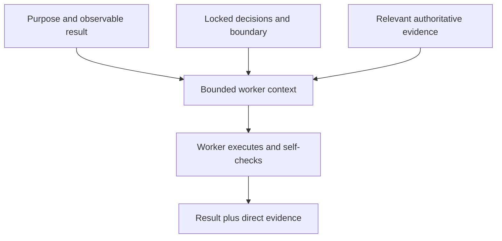

# Context For Workers

[HEAD Agent Core](../../README.md) / [Learn](../README.md) / [Context](README.md) / Context For Workers

## Learning Objective

Build a worker context that is complete for one result but does not transfer HEAD's broader ownership.

## The Bounded Brief

A worker receives one coherent outcome, its purpose, locked decisions, relevant evidence, allowed surface, and the evidence that will show completion. This gives enough room for local diagnosis and execution without asking the worker to infer project direction or rewrite the work model.

## Design Response

Shape the assignment around an independently observable outcome and let the worker choose local methods within its boundary. The rejected alternative is sending broad history and an open-ended instruction to discover what matters. That invites guesses, expands authority, and makes completion hard to verify.

If a material choice falls outside the brief, the worker reports the issue and supporting evidence. It does not silently extend the assignment. The worker report is execution evidence; HEAD verifies it before treating it as a canonical conclusion.

## Retrospective Related Theory

**Related theory, retrospective:** this resembles least authority, bounded context, and single responsibility. The comparison is an explanatory lens, not a claim that theory names originated the practice.

## Common Misunderstanding

Bounded context is not deliberately incomplete context. Omit unrelated history, not information needed to produce and demonstrate the promised result.

## Takeaway

Give a worker the smallest complete set of authoritative information for one verifiable outcome, plus a clear boundary for escalation.

Previous: [Context For HEAD](context-for-head.md) | Next: [Context Antipatterns](context-antipatterns.md)

Source class: current shared delegation contract and context-management architecture.
