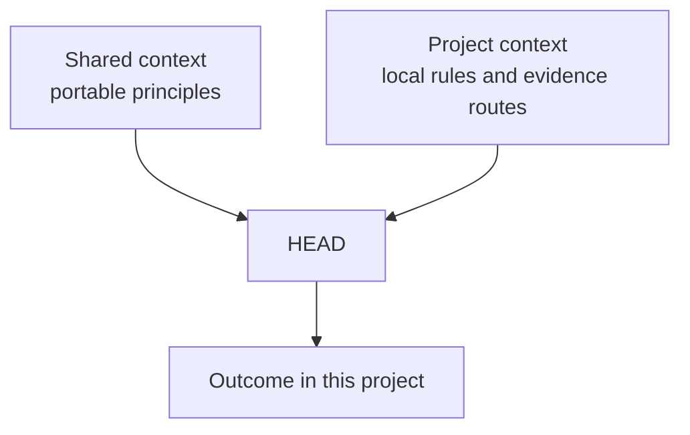

# Shared Vs. Project Context

[HEAD Agent Core](../../README.md) / [Learn](../README.md) / [Context](README.md) / Shared Vs. Project Context

## Learning Objective

Separate portable operating principles from project-specific facts and decisions.

## Two Change Owners

Shared context carries principles that remain useful after project names, domain facts, specialist routing, and private data are removed. Project context carries the facts, policies, tools, and local authority that make work correct in one environment. They compose at use time without being copied into each other.

## Design Response

Keep shared guidance small and generative, while the project owns its changing details. The rejected alternative is publishing a project overlay as if it were a universal rule, or placing universal guidance inside each project. Both cause drift and can cross a publication boundary.

## Authority Boundary

Shared principles guide reasoning but do not authorize a project decision. Project policy can supply applicable local constraints, while material direction remains with the user. A portable layer must not invent facts that only a project can establish.

## Common Misunderstanding

Shared does not mean more authoritative than project policy. The layers answer different questions: how to reason and own work, versus what is true and permitted here.

## Takeaway

Share principles that survive removal of local facts; keep local facts, policies, and capabilities with the project that owns them.

Previous: [Index, Not Payload](index-not-payload.md) | Next: [Context For HEAD](context-for-head.md)

Source class: current shared Core principles and public shared/project architecture.
