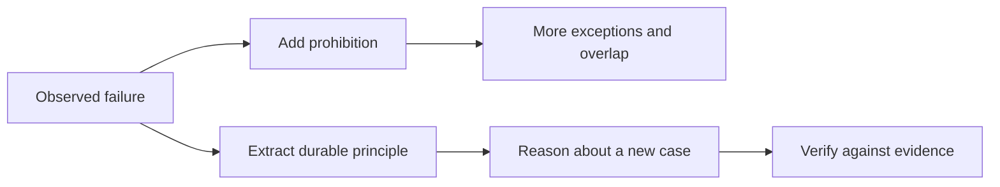

# General Rules: Principles Instead Of An Endless Deny List

[HEAD Agent Core](../../README.md) / [Learn](../README.md) / General Rules

## Learning Objective

Understand why portable Core guidance favors compact, generative principles while detailed conditional procedures belong in on-demand Skills.

## Core Claim

A deny list grows by naming past mistakes. A generative rule gives an owner a way to reason about new situations while preserving an explicit authority boundary.

## Chapter Map

1. [Why Deny Lists Grow Forever](why-deny-lists-grow-forever.md) identifies the maintenance trap.
2. [Generative Rules](generative-rules.md) defines principles that guide local reasoning.
3. [Core Versus Procedure](core-vs-procedure.md) separates always-loaded principles from conditional Skills.
4. [Preserving Agent Autonomy](preserving-agent-autonomy.md) shows how a bounded outcome permits technical judgment without policy invention.
5. [Evolving HEAD Core](evolving-head-core.md) explains the historical simplification at the level of rationale, not instruction text.

## Scope Of This Chapter

This chapter describes a design shift supported by current shared Core and planning practices. It does not reproduce instruction bodies or claim that a small set of principles automatically resolves every edge case. Project policy, safety boundaries, and detailed procedures remain explicit where they are needed.

Previous: [Context](../04-context/README.md) | Next: [Why Deny Lists Grow Forever](why-deny-lists-grow-forever.md)

Source class: current shared Core and planning Skills; repository evolution.
