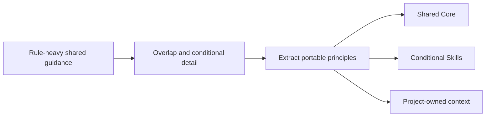

# Evolving HEAD Core

[HEAD Agent Core](../../README.md) / [Learn](../README.md) / [General Rules](README.md) / Evolving HEAD Core

## Learning Objective

Understand the design rationale for reducing a rule-heavy shared Core into a compact set of portable principles without reproducing private instruction content.

## The Shift Was Simplification After Experience

Earlier shared guidance contained more detailed rules and hard limits. Later revisions replaced much of that detail with compact principles and conditional Skills. The intended design effect is to reduce overlap, maintenance cost, and overgeneralization while preserving necessary boundaries; those effects are rationale, not measured historical outcomes.

The current direction is to keep the shared Core focused on durable ownership and reasoning principles. Detailed workflows are moved to conditional Skills; project facts and policy remain project-owned. This is a design-rationale comparison, not a reproduction of either version's instruction bodies.

## What Did Not Change

Simplification does not remove safety, verification, or authority boundaries. It changes where detail lives and how broadly it is loaded. A compact Core still needs explicit project policy and task-specific procedures when the situation requires them.

## Historical Status

**Historical record:** repository evolution and current shared materials support the shift from more accumulated guidance toward compact principles and conditional procedures. This page intentionally stays at that public design-rationale level. It makes no claim about private prompts, internal wording, or every intermediate implementation.

## Common Misunderstanding

A shorter Core is not automatically better. It is better only when the removed text was redundant, overly specific, or more accurately owned by a conditional or project-specific layer.

## Takeaway

Keep the shared foundation small enough to remain portable, and put specificity where its condition and owner are visible.

Previous: [Preserving Agent Autonomy](preserving-agent-autonomy.md) | Back to: [General Rules](README.md) | Next: [Canon](../06-canon/README.md)

Source class: shared Core repository evolution; current shared Core and planning Skills.
