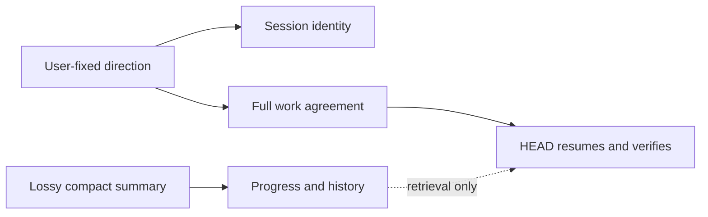

# Canon: Keeping The Agreement Through Compaction

[HEAD Agent Core](../../README.md) / [Learn](../README.md) / Canon

## Learning Objective

Understand why the user-fixed work agreement must remain outside a lossy model summary, and how a small fixed recovery contract preserves it.

## Core Claim

Compaction can preserve useful handoff information, but it cannot safely become the authority for what the user asked for or what counts as complete. The durable agreement remains available in separate session files.

## Chapter Map

1. [What Compaction Loses](what-compaction-loses.md) shows why a summary is not a complete agreement.
2. [Fixing The Problem And Goal](fixing-the-problem-and-goal.md) names the information that must remain canonical.
3. [Context And Run](context-and-run.md) separates stable session identity from the full work agreement.
4. [Fragile Progress And History](fragile-progress-and-history.md) retains retrieval value without granting authority.
5. [The Failed Recovery Story](the-failed-recovery-story.md) generalizes a failure in which validation passed a reduced scope.
6. [The Two-File Contract](the-two-file-contract.md) explains fixed-path recovery and the rejected fallback mechanisms.

## Scope

This chapter describes the current shared recovery contract, not a universal claim that summaries have no value. It does not publish project context, private work records, internal paths, or implementation bodies. See the [Shared Core](../../head/README.md) and repository [architecture overview](../../README.md) for public reference context.

Previous: [General Rules](../05-general-rules/README.md) | Next: [What Compaction Loses](what-compaction-loses.md)

Source class: current shared runtime contract; generalized failure; operational observation.
