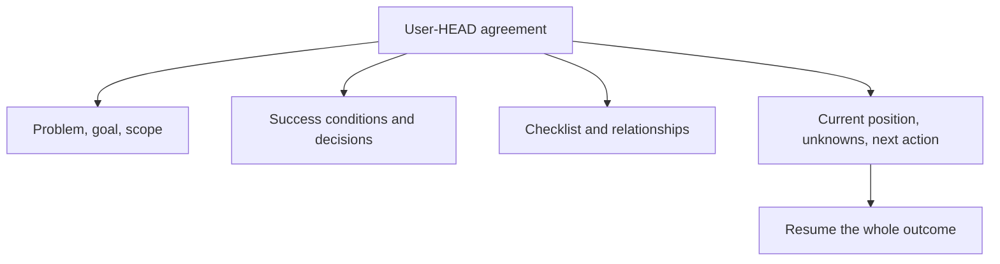

# Fixing The Problem And Goal

[HEAD Agent Core](../../README.md) / [Learn](../README.md) / [Canon](README.md) / Fixing The Problem And Goal

## Learning Objective

Know which information must survive interruption as the user-HEAD agreement rather than as a best-effort handoff.

## The Durable Work Model

For non-trivial work, the durable agreement preserves the information needed to resume the whole outcome, not merely the most recent activity:

| Canonical element | Why it matters on recovery |
| --- | --- |
| Fixed problem and goal | Prevents a local result from becoming the destination. |
| Intended scope | Separates included work from plausible but unapproved additions. |
| Success conditions | Keeps verification aimed at the agreed result. |
| User decisions | Preserves choices that ordinary planning must not reopen. |
| Work relationships and checklist | Shows completed and remaining work in the full model. |
| Current position | Locates the work without redefining it. |
| Unverified assumptions | Makes uncertainty explicit rather than silently resolving it. |
| Exact next action | Gives recovery a concrete, checkable continuation. |
| Evidence locations | Allows later claims to be checked at their source. |

## What May Change

HEAD updates the checklist and current position as work advances. The agreed requirements, scope, success conditions, and overall model do not change merely because a later summary, report, or local implementation suggests a narrower interpretation. A user changes that agreement.

## Related Theory

This resembles a control-plane record: durable direction is distinct from the changing observations used to operate. This is a retrospective interpretation, not a claim about the original source of the design.

## Takeaway

Canon fixes the target and records where the work stands; it does not freeze ordinary execution.

Previous: [What Compaction Loses](what-compaction-loses.md) | Next: [Context And Run](context-and-run.md)

Source class: current shared recovery contract.
