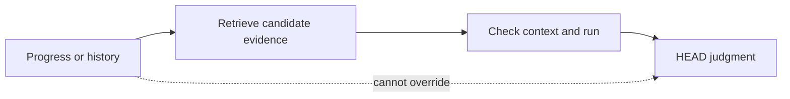

# Fragile Progress And History

[HEAD Agent Core](../../README.md) / [Learn](../README.md) / [Canon](README.md) / Fragile Progress And History

## Learning Objective

Use progress and history as helpful retrieval records without confusing them with the user-HEAD agreement.

## Useful, But Not Authoritative

Compaction can update a progress record and append completed-work history. These records can help HEAD locate prior activity, decide which evidence to reopen, or understand a handoff. They are LLM-managed and may be incomplete, stale, or shaped by an earlier mistaken interpretation.

| Record | Appropriate use | Not permitted to do |
| --- | --- | --- |
| Progress | Locate a possible current state or handoff | Redefine scope or declare the agreed outcome complete. |
| History | Find past work and evidence candidates | Prove that a retrospective account is authoritative. |
| Run | Resume and judge the whole outcome | Replace detailed evidence when a claim needs checking. |

## Observed History Versus Interpretation

History records what it says was done. It does not automatically establish why it was done, whether it met the original success conditions, or whether its completion claim survived later evidence. Those are retrospective judgments that must be checked against the agreement and relevant evidence.

## Rejected Alternative

Automatically injecting progress or history makes a fragile representation disproportionately influential at the moment recovery begins. The current contract keeps those records persisted and available for deliberate retrieval, rather than presenting them as recovery authority.

## Takeaway

History can lead back to evidence. It cannot replace the agreement used to interpret that evidence.

Previous: [Context And Run](context-and-run.md) | Next: [The Failed Recovery Story](the-failed-recovery-story.md)

Source class: current shared recovery contract; operational observation.
