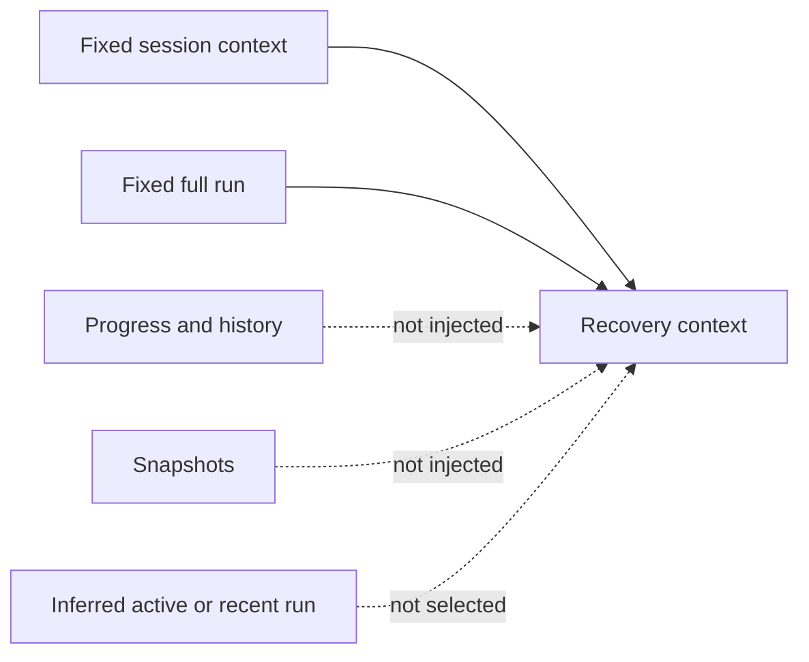

# The Two-File Contract

[HEAD Agent Core](../../README.md) / [Learn](../README.md) / [Canon](README.md) / The Two-File Contract

## Learning Objective

Understand why recovery reads two fixed files in order and intentionally avoids inferred selection and fallback mechanisms.

## Fixed Recovery Basis

At recovery, the runtime reads the session's fixed context file and fixed run file, in that order. If either is missing, it is omitted quietly. No substitute is selected.

This small contract is deliberate. It makes recovery inputs inspectable: HEAD can know which durable sources were present rather than reasoning from a hidden selection process.

## Why Fallback Selection Does Not Replace Agreement

An inferred active run, a recent-run guess, a snapshot, or a fallback candidate may be useful information in a human-led investigation. None proves that it is the user-approved agreement for the session now being recovered. Choosing one automatically can introduce an incorrect work model precisely when recovery needs a reliable one.

The same applies to progress and history. They may describe activity, but they cannot establish the scope, success conditions, user decisions, current position, unknowns, and exact next action that the agreement must retain.

## Design Response And Limitation

The system favors fixed paths over discovery algorithms, pointers, anomaly gates, transcript fallbacks, or snapshot fallbacks. This reduces machinery and avoids silent substitution. If a fixed file does not exist, recovery proceeds without that file rather than inventing a replacement; the missing agreement is a condition to resolve explicitly, not an opportunity for automatic guesswork.

## Common Misunderstanding

Fixed paths do not make all recovery automatic. HEAD still follows the run's checklist, explicitly retrieves slices or evidence when needed, and rechecks mutable facts before acting.

## Takeaway

Simple recovery is not less careful: it preserves the authority boundary by refusing to guess which derivative record should stand in for the agreement.

Previous: [The Failed Recovery Story](the-failed-recovery-story.md) | Back to: [Canon](README.md)

Source class: current shared runtime contract; operational observation.
