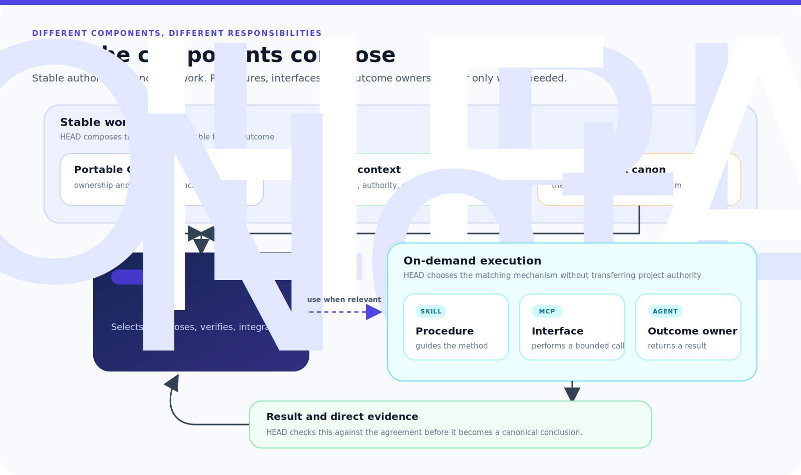

# Components: The Parts Of A Controlled System

[HEAD Agent Core](../../README.md) / [Learn](../README.md) / Components

## Learning Objective

Identify what each architectural layer owns, when it becomes available, and why a callable capability, a procedure, and an outcome owner are not interchangeable.

## Core Claim

HEAD is not one large prompt. It is a composition of small layers with different owners and delivery times. The separation keeps portable reasoning stable, local knowledge private, and execution accountable.

## Chapter Map

1. [Core](core.md) establishes portable, always-loaded ownership and reasoning principles.
2. [Project Context](project-context.md) supplies local rules, indexes, and retrieval routes.
3. [MCP](mcp.md) defines callable interfaces and enforceable runtime boundaries.
4. [Skills](skills.md) hold conditional procedures and usage knowledge.
5. [Agents](agents.md) define reusable owners for bounded outcomes.
6. [Runtime Canon](runtime-canon.md) preserves the agreement through interruption and recovery.
7. [How The Parts Compose](how-the-parts-compose.md) follows the layers through one controlled loop.

## The Distinction That Prevents Category Errors

| Question | Layer that answers it |
| --- | --- |
| How should HEAD reason and retain ownership? | Core |
| What is true or permitted in this project, and where is proof? | Project context |
| What operation can the runtime call and enforce? | MCP |
| When and how should a matching task be carried out? | Skill |
| Who owns this coherent result and within what authority? | Agent |
| What did the user and HEAD agree to accomplish? | Runtime canon |

These layers cooperate, but none can stand in for another. A tool does not grant authority. A procedure does not make a worker accountable for a result. A worker report does not replace the work agreement.

## Reference Path

For the current public contracts, see [Shared Core](../../head/README.md), [Project Layer](../../projects/README.md), [Shared MCP](../../mcp/README.md), [Shared Skills](../../skills/README.md), [Shared Agents](../../agents/README.md), and [Session Canon](../../projects/context/session-canon.md).

## Takeaway

Composition is a control design: load durable principles, retrieve local authority, call interfaces on demand, load procedures when they match, assign bounded ownership, and preserve the agreement throughout.

Previous: [Canon](../06-canon/README.md) | Next: [Core](core.md) | Then: [Operation](../08-operation/README.md)

Source class: current public shared and project-extension reference pages; current shared runtime contract.
