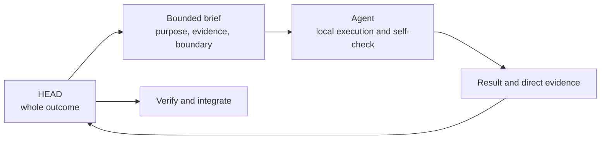

# Agents: Reusable Owners Of Bounded Outcomes

[HEAD Agent Core](../../README.md) / [Learn](../README.md) / [Components](README.md) / Agents

## Learning Objective

Understand an Agent as a reusable ownership contract with explicit authority, not as a general-purpose autonomous participant.

## What An Agent Owns

An Agent receives one coherent, observable outcome and the smallest complete context needed to carry it from diagnosis through direct evidence. Its contract defines the role's authority boundary, expected result, and return discipline. HEAD retains the whole work model, cross-outcome dependencies, integration, and final conclusion.

The boundary gives the Agent room for local technical judgment without granting authority to invent policy, expand the scope, or settle material user decisions. If the work reaches such a decision, the Agent returns the evidence and question to HEAD.

## Role Is Not Mechanism

An Agent may load a Skill and call an MCP, but those do different jobs. A Skill supplies a method. An MCP supplies a callable capability under runtime rules. The Agent supplies accountable ownership of the bounded result. None of the three guarantees the others.

## Shared And Project Agents

Shared Agent contracts preserve reusable ownership shapes across projects. A project can overlay local repository rules or define a domain-specific specialist, provided the owner still has a coherent result and explicit authority. Local routing and evidence sources remain project-owned.

## Reference Path

See [Shared Agents](../../agents/README.md), [Developer Core](../../agents/developer/README.md), [Validator Core](../../agents/validator/README.md), and [Project Agents](../../projects/agents/README.md). The underlying assignment model is introduced in [Bounded Agent Ownership](../03-ownership/bounded-agent-ownership.md).

## Takeaway

Assign an Agent a complete, observable result with explicit limits. Delegate neither the whole unresolved project nor decisions that remain with HEAD or the user.

Previous: [Skills](skills.md) | Next: [Runtime Canon](runtime-canon.md)

Source class: current public Agent reference pages; current delegation and ownership model.
