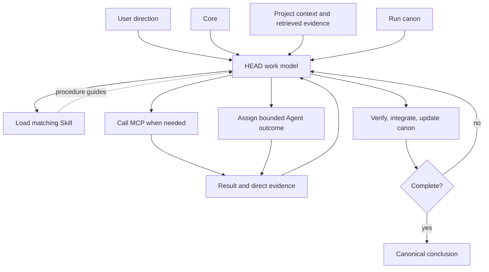

# How The Parts Compose

[HEAD Agent Core](../../README.md) / [Learn](../README.md) / [Components](README.md) / How The Parts Compose

## Learning Objective

Trace one public-safe outcome through Core, project context, runtime canon, Skills, MCP, Agents, evidence, and HEAD integration.

## One Controlled Loop

Consider a community group that asks for a public workshop guide. The request fixes the intended result and any material choices. HEAD turns that direction into a work model: what is known, what must be checked, which results compose, and what direct evidence will show completion.

1. **Core:** HEAD keeps ownership of the full outcome and separates user decisions from ordinary planning.
2. **Project context:** HEAD uses the project's index to locate the current approved accessibility guidance and venue brief, then retrieves only those relevant sources.
3. **Runtime canon:** the work agreement records the goal, scope, success conditions, decisions, unverified assumptions, and next action so it can survive interruption.
4. **Skill:** a matching writing or review procedure provides the conditional method and evidence expectations.
5. **MCP:** when a runtime operation is needed, HEAD calls the appropriate interface, whose contract enforces its allowed boundary.
6. **Agent:** HEAD assigns one bounded result, such as checking the guide against the retrieved requirements, with the required evidence and explicit authority limit.
7. **Verification and integration:** HEAD checks the returned evidence against the source and agreement, integrates the result, and decides the next bounded expansion or asks the user about a material choice.

## What The Diagram Does Not Say

Not every request needs every component. Small, immediately verifiable work may need no durable run and no delegation. An MCP may be unnecessary when no callable interface is needed. A Skill is loaded only when its procedure matches. The invariant is not maximum machinery; it is preserving authority, relevant evidence, and observable completion at the scale of the work.

## Failure Checks

| If this happens... | The missing distinction is often... |
| --- | --- |
| A callable tool is treated as permission to change scope | Interface versus decision authority |
| A procedure is assumed to guarantee a correct outcome | Method versus verification |
| A worker is given broad history and no observable target | Context volume versus bounded ownership |
| A compact summary becomes the task definition | Retrieval record versus runtime canon |
| Local facts are added to shared guidance | Portable Core versus project context |

## Reference Path

Return to the [architecture overview](../../README.md) and follow its links to [Shared Core](../../head/README.md), [Project Layer](../../projects/README.md), [Shared MCP](../../mcp/README.md), [Shared Skills](../../skills/README.md), [Shared Agents](../../agents/README.md), and [Session Canon](../../projects/context/session-canon.md).

## Takeaway

HEAD composes layers at the point of need: principles guide judgment, project context establishes local truth, canon preserves the agreement, Skills guide procedures, MCPs expose enforceable operations, and Agents return bounded evidence for verification and integration.

Previous: [Runtime Canon](runtime-canon.md) | Back to: [Components](README.md) | Next: [Operation](../08-operation/README.md)

Source class: current public architecture and runtime reference pages; generalized operational example.
