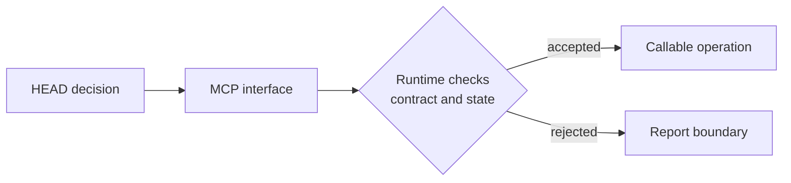

# MCP: Callable Interfaces And Enforced Boundaries

[HEAD Agent Core](../../README.md) / [Learn](../README.md) / [Components](README.md) / MCP

## Learning Objective

Understand MCP as the runtime's callable interface layer, including its ability to enforce an operation's safety and session boundary.

## What An MCP Provides

An MCP exposes a defined operation to the runtime. Its contract can constrain inputs, reject unsupported requests, limit a call to read-only behavior, require an approval step, or keep session control tied to an exact runtime state. Those are properties of the interface and its enforcement, not merely advice in a prompt.

The interface makes a capability available. It does not decide whether the capability is appropriate for the outcome, and it does not own the outcome produced by calling it.

## Tool, Procedure, And Ownership

| Thing | Primary question | It does not provide |
| --- | --- | --- |
| MCP | What can the runtime call under this contract? | A task-specific method or outcome owner |
| Skill | When and how should a matching task be performed? | A runtime-enforced callable interface |
| Agent | Who can carry this bounded result to completion? | Automatic permission or a procedure |

For example, a coordination interface may start a bounded worker task, while a delegation Skill explains how to shape that task and HEAD remains responsible for deciding whether delegation is appropriate. The worker, not the interface, owns the assigned result.

## Shared And Project Interfaces

An interface is shared when its contract remains useful and safe after local facts are removed. Interfaces whose behavior relies on local credentials, private schemas, or project-specific mutation rules belong to the project layer. Both types are called on demand.

## Reference Path

See [Shared MCP](../../mcp/README.md), the public [agent-task reference](../../mcp/agent-task/README.md), and [Project MCP](../../projects/mcp/README.md). For the companion procedure, see [delegate-task](../../skills/delegate-task/README.md).

## Takeaway

MCP makes an operation callable and can enforce its boundary. It does not replace the judgment in a Skill or the accountability in an Agent assignment.

Previous: [Project Context](project-context.md) | Next: [Skills](skills.md)

Source class: current public MCP reference pages; current tool and coordination architecture.
