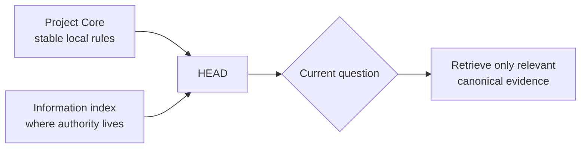

# Project Context: Local Truth And Retrieval Routes

[HEAD Agent Core](../../README.md) / [Learn](../README.md) / [Components](README.md) / Project Context

## Learning Objective

Separate project-owned rules and facts from the portable Core, and understand why an index routes to evidence instead of copying all knowledge into active context.

## What Project Context Owns

Every project supplies facts that shared Core cannot know: local authority boundaries, stable rules, canonical sources, and the routes used to retrieve detailed evidence. A small project Core can be available from the start; a project information index points to deeper sources that are read only when the current outcome needs them.

An index is not a substitute for its sources. It helps HEAD find the source that owns a claim while avoiding a large, stale, or conflicting context dump.

## Ownership Boundary

Project context can constrain how shared principles apply locally, but it does not change the portable meaning of those principles. It also does not silently decide a material user-owned question. When the evidence is missing or the decision is user-owned, HEAD must surface that gap rather than infer a local rule.

## A Public-Safe Example

Imagine a civic workshop team preparing a public event guide. Its project context identifies the approved accessibility policy and the current venue brief as authoritative sources. HEAD retrieves those sources when checking the guide. It does not preload every past event note or treat an old summary as current policy.

The example shows a route, not a private data model: project context identifies where authority lives; the source establishes the fact.

## Reference Path

See [Project Layer](../../projects/README.md), [Project Core](../../projects/core/README.md), and [Additional Context](../../projects/context/README.md). The public context index model is described by [Project Information Index](../../projects/context/project-index.md).

## Takeaway

Project context owns local truth and the routes to proof. It is composed with Core at runtime, not copied into the shared layer or every assignment.

Previous: [Core](core.md) | Next: [MCP](mcp.md)

Source class: current public project-extension reference pages; context-management architecture.
