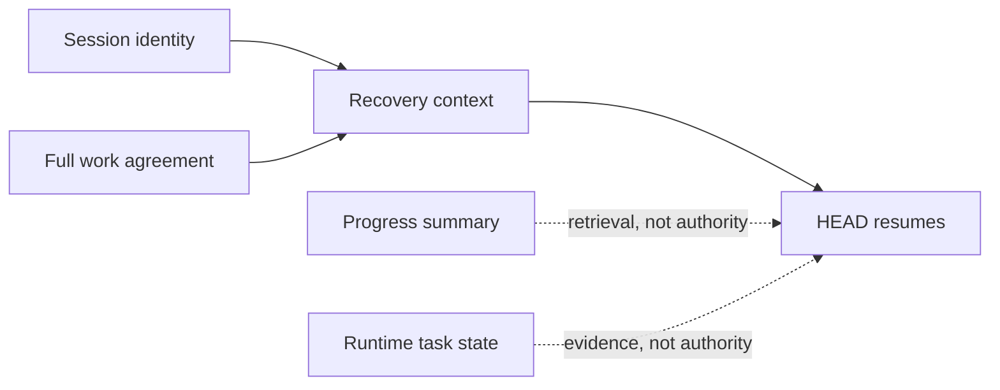

# Runtime Canon: Preserving The Agreement

[HEAD Agent Core](../../README.md) / [Learn](../README.md) / [Components](README.md) / Runtime Canon

## Learning Objective

Understand why runtime recovery preserves the user-HEAD agreement separately from temporary summaries, task state, and worker reports.

## What Runtime Canon Preserves

The active work needs a durable authority record: the session identity and the full agreement describing the requested outcome, scope, success conditions, decisions, current situation, and next action. Recovery reloads that canon so interruption or compaction cannot silently replace the agreement with a shorter model-generated account.

Runtime state can still be useful. It may describe a running task, a handoff, or historical activity. Its usefulness does not make it authoritative over the user-approved agreement. The same is true of an Agent report: it is evidence for HEAD to verify, not a change to the work's scope.

## Relationship To Other Components

Core says that durable work continues from canon. Project context supplies the sources needed to recheck local facts. Skills can prescribe a recovery procedure. MCP interfaces can control runtime operations. Agents can return bounded work. Runtime canon is the layer that keeps all of those actions tied to the same user-HEAD agreement.

## Reference Path

See [Session Canon](../../projects/context/session-canon.md), the [compact runtime contract](../../runtime/opencode/COMPACT_CONTRACT.md), and the preceding chapter's [Two-File Contract](../06-canon/the-two-file-contract.md).

## Takeaway

Preserve the agreement outside model summaries. Treat runtime records and worker outputs as useful evidence until they are checked against the canon.

Previous: [Agents](agents.md) | Next: [How The Parts Compose](how-the-parts-compose.md)

Source class: current public session-canon and runtime-contract reference pages; context-management architecture.
