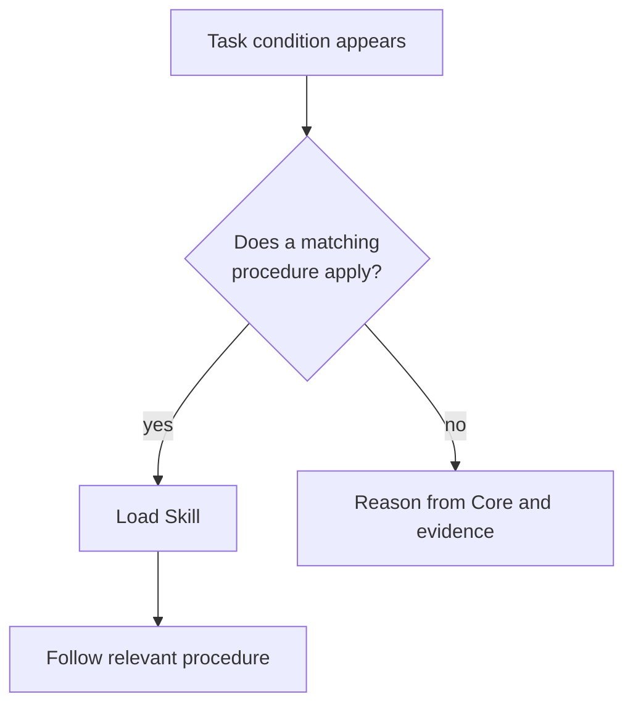

# Skills: Procedures Loaded At The Decision Point

[HEAD Agent Core](../../README.md) / [Learn](../README.md) / [Components](README.md) / Skills

## Learning Objective

Understand why detailed workflows and domain usage knowledge load on demand rather than expanding the always-loaded Core.

## What A Skill Provides

A Skill is a procedure for a recognizable situation. It can explain prerequisites, an evidence sequence, safe use of an interface, common pitfalls, and the expected form of a result. It is loaded when its trigger matches the task, keeping the default context focused on stable principles.

Skills can include domain usage knowledge when that knowledge belongs to a project. The shared library contains only procedures whose trigger, authority boundary, and result remain meaningful without local facts.

## Why A Skill Is Not A Tool

A Skill may direct HEAD to use an MCP, a script, or another permitted mechanism. It is still not the mechanism itself. The runtime enforces the interface contract; the Skill explains the task-specific method. Keeping both distinctions visible prevents prose from being mistaken for a technical safety boundary.

Likewise, a Skill does not own a result. It can guide the owner, but HEAD or a bounded Agent remains accountable for the outcome and its evidence.

## Reference Path

Browse [Shared Skills](../../skills/README.md) for reusable procedures, including [start-work](../../skills/start-work/README.md), [restore-session](../../skills/restore-session/README.md), and [delegate-task](../../skills/delegate-task/README.md). Local workflows belong in [Project Skills](../../projects/skills/README.md).

## Takeaway

Use Skills for conditional know-how. Keep Core portable, let MCP enforce callable boundaries, and retain explicit ownership of the result.

Previous: [MCP](mcp.md) | Next: [Agents](agents.md)

Source class: current public Skill and project-extension reference pages; planning practice.
