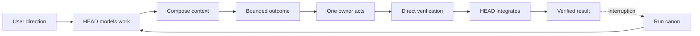

# Operation: From Request To Verified Result

[HEAD Agent Core](../../README.md) / [Learn](../README.md) / Operation

## Learning Objective

Learn a scale-sensitive operating loop that turns a request into an observed, integrated result without moving material decisions away from the user.

## Core Claim

The loop is not a ritual. HEAD adds structure when coordination, uncertainty, or recovery needs make it useful, then verifies each result before using it as input to downstream work.

## Chapter Map

1. [Small Work Versus Durable Work](small-work-vs-durable-work.md)
2. [Building The Work Model](building-the-work-model.md)
3. [Composing Context](composing-context.md)
4. [Shaping A Bounded Outcome](shaping-a-bounded-outcome.md)
5. [Delegation](delegation.md)
6. [Verification](verification.md)
7. [Integration](integration.md)
8. [Recovery](recovery.md)
9. [End-To-End Example](end-to-end-example.md)

## Scope

This chapter teaches an operating model, not a mandatory workflow engine. Current interfaces and contracts remain in the public [Core](../../head/README.md), [MCP](../../mcp/README.md), [Skills](../../skills/README.md), [Agents](../../agents/README.md), and [project-layer](../../projects/README.md) references.

Previous conceptual chapter: [Components](../07-components/README.md) | Next: [Small Work Versus Durable Work](small-work-vs-durable-work.md)

Source class: current shared principles; current public reference contracts; operational observation.
