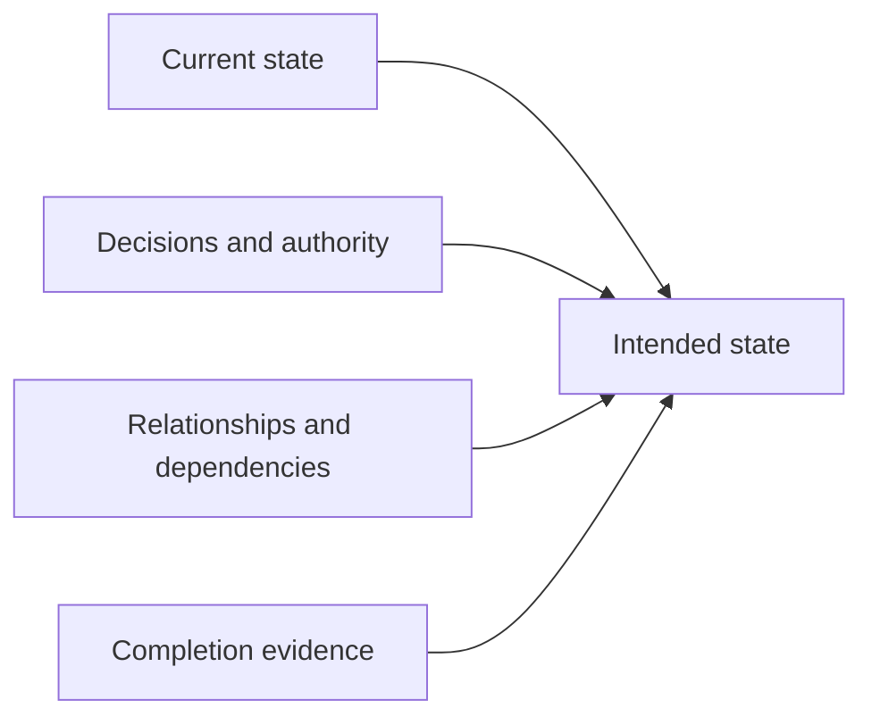

# Building The Work Model

[HEAD Agent Core](../../README.md) / [Learn](../README.md) / [Operation](README.md) / Building The Work Model

## Learning Objective

Make the structure of non-trivial work explicit before expanding it into action.

## Core Claim

A work model connects the current state to an intended state through relationships, dependencies, decisions, and completion evidence. It is a representation for judgment, not a fixed document template.

## Builder Lens

An action list can hide why its steps matter or whether they can safely run in parallel. A work model asks what exists now, what must become true, who may decide changes, what results rely on one another, and what observation will establish completion.

## Design Response

HEAD holds the whole model and details the next coherent result to execution depth. The user retains material direction. A worker, if used, chooses local technical means inside its bounded result rather than rewriting the larger goal.

## Related Theory

This resembles dependency-aware planning and directed acyclic graph scheduling. That is a retrospective explanatory lens, not a claim that a particular theory dictated the system's history.

## Common Misunderstanding

Explicit does not mean exhaustive prediction. Evidence may reveal that the model is wrong; update it before continuing rather than defending an obsolete plan.

## Takeaway

Model the conditions and relationships that determine completion, then act from that model.

Previous: [Small Work Versus Durable Work](small-work-vs-durable-work.md) | Next: [Composing Context](composing-context.md)

Source class: current shared principles; related theory.
