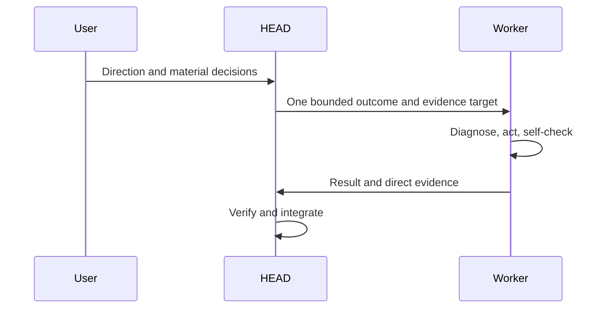

# Delegation

[HEAD Agent Core](../../README.md) / [Learn](../README.md) / [Operation](README.md) / Delegation

## Learning Objective

Transfer one result to one owner while preserving decision rights and the parent outcome.

## Core Claim

Delegation gives a worker ownership of bounded local execution, not ownership of the user's direction or HEAD's integration judgment. The owner receives the smallest complete context and returns direct outcome evidence.

## Design Response

A delegation states why the result matters, authoritative inputs, locked decisions, ownership boundary, consumable output, and completion evidence. The worker has technical autonomy within that boundary. HEAD retains dependencies, evidence selection, integration, and the canonical conclusion.

## Public References

The [delegate-task Skill](../../skills/delegate-task/README.md) defines the reasoning procedure; the [agent-task MCP](../../mcp/agent-task/README.md) is the shared coordination interface; [shared Agents](../../agents/README.md) describe reusable role boundaries.

## Common Misunderstanding

More workers do not automatically improve throughput. Parallel work begins only when inputs and mutation surfaces are independent and the output contracts can compose.

## Takeaway

Give one owner one complete result, then require evidence that HEAD can use.

Previous: [Shaping A Bounded Outcome](shaping-a-bounded-outcome.md) | Next: [Verification](verification.md)

Source class: current shared principles; current public reference contracts.
