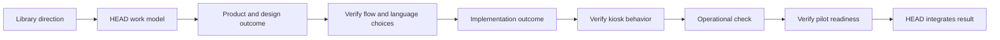

# End-To-End Example: A Library Kiosk Pilot

[HEAD Agent Core](../../README.md) / [Learn](../README.md) / [Operation](README.md) / End-To-End Example

## Learning Objective

Follow one synthetic outcome from a user request through product, design, implementation, operational verification, integration, and recovery.

## Synthetic Scenario

This example is fictional and unrelated to any private project. A community library wants a small multilingual room-booking kiosk pilot. The user fixes the material direction: support the library's chosen languages, make the pilot available only in the designated room area, and do not expand the pilot’s scope without approval.

## 1. Choose The Right Shape

This is durable work: it has product choices, a public-facing flow, implementation dependencies, and a need to resume after interruption. HEAD creates a run that records the goal, the designated pilot boundary, success conditions, known dependencies, open questions, and the next result. The user, not HEAD or a worker, decides whether to add languages, locations, or new booking policies.

## 2. Build The Work Model

The current state is that no pilot flow exists. The intended state is a kiosk that lets visitors complete the agreed room-booking flow in the chosen languages within the designated area. Product clarification and interaction design must be concrete before implementation; implementation must be directly checked before an operational readiness check can rely on it.

## 3. Compose Context And Slice Outcomes

HEAD retrieves only the library-approved pilot direction, relevant accessibility guidance, the kiosk environment constraints, and the run. It first shapes a product-and-design outcome: a reviewed booking flow, language treatment, and observable acceptance examples. A second owner later receives the approved flow and relevant implementation constraints, not the entire planning history.

## 4. Verify Before Expansion

The design owner demonstrates the flow against the acceptance examples. HEAD verifies that the flow preserves the user’s boundary and resolves no unapproved policy. Only then does implementation begin. The implementation owner produces the kiosk behavior and direct evidence that each agreed language can complete the flow. A status claim alone would not release the operational check.

## 5. Integrate And Operate

HEAD checks that the verified behavior matches the approved design, then assigns an operational outcome: confirm the kiosk can present the agreed flow in its designated area and record the observation required by the run. If that check exposes an environmental problem, HEAD reopens the relevant bounded outcome rather than declaring readiness from confidence.

## 6. Recover If Interrupted

If work stops after design verification, a new session reads the run canon, sees that implementation is the next outcome, retrieves the approved flow and constraints, and continues. It does not infer scope from a summary or reopen the user’s material decisions without a reason.

## Takeaway

The same loop protects a mixed product, design, implementation, and operational outcome: user direction remains stable; HEAD models and integrates; each owner delivers a bounded, evidenced result; verification precedes downstream expansion.

Previous: [Recovery](recovery.md) | Back to: [Operation](README.md) | Next: Decisions (planned Chapter 09)

Source class: synthetic example; current shared principles; operational observation.
