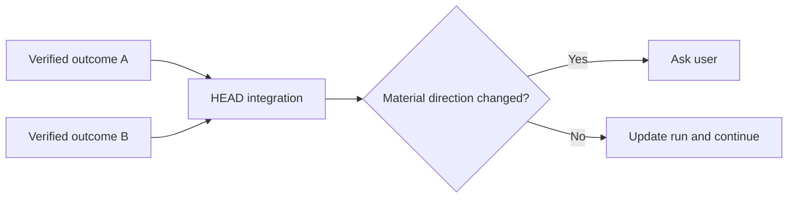

# Integration

[HEAD Agent Core](../../README.md) / [Learn](../README.md) / [Operation](README.md) / Integration

## Learning Objective

Understand why HEAD, rather than a chain of workers, composes verified local results into the whole outcome.

## Core Claim

Integration reconnects a verified result to the work model: HEAD checks dependencies, resolves ordinary cross-slice choices, updates the canonical current state, and identifies the next coherent outcome.

## Design Response

HEAD retains broad context so it can detect contradiction, missing dependency, or a user-owned decision. It does not silently turn a local worker result into a new project direction. The run canon records the current position and exact next action when the work is durable.

## Related Theory

The separation resembles a control plane coordinating execution planes. This is a retrospective explanatory analogy, not a claim about original implementation intent.

## Common Misunderstanding

Integration does not require HEAD to redo verified local work. It consumes the evidence, tests composability, and reopens a result only when the evidence is insufficient or the larger model changes.

## Takeaway

Workers produce bounded results; HEAD makes those results cohere into the user’s whole outcome.

Previous: [Verification](verification.md) | Next: [Recovery](recovery.md)

Source class: current shared principles; current shared runtime contract; related theory.
