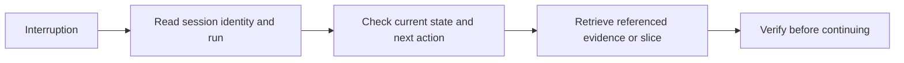

# Recovery

[HEAD Agent Core](../../README.md) / [Learn](../README.md) / [Operation](README.md) / Recovery

## Learning Objective

Resume durable work from its canonical agreement rather than from a lossy summary or a guess about recent activity.

## Core Claim

After interruption, HEAD starts from the session canon, re-establishes the current outcome, and retrieves the referenced evidence or slice needed to continue. Progress records can help locate history but do not replace the agreement.

## Design Response

The run preserves purpose, scope, success conditions, decisions, current situation, and exact next action. Supporting evidence remains referenced rather than permanently loaded. Recovery therefore reconstructs the work model from authority, not from a compressed recollection.

## Public References

The [Session Canon reference](../../projects/context/session-canon.md) states the architectural boundary. The [runtime compact contract](../../runtime/opencode/COMPACT_CONTRACT.md) documents that the fixed context and run remain authoritative over generated summaries.

## Common Misunderstanding

Canon is not a complete substitute for verification. A resumed task must still check mutable facts and directly validate any prior result whose evidence is missing or no longer applicable.

## Takeaway

Resume from the agreement, retrieve what it references, and re-establish evidence before continuing.

Previous: [Integration](integration.md) | Next: [End-To-End Example](end-to-end-example.md)

Source class: current shared runtime contract; current public reference contracts.
