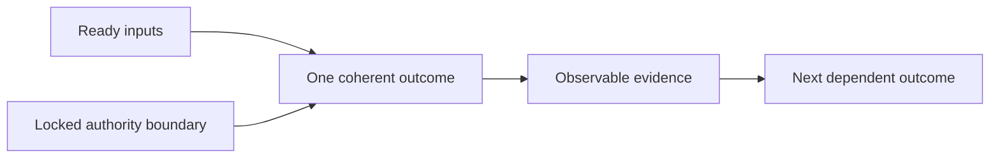

# Shaping A Bounded Outcome

[HEAD Agent Core](../../README.md) / [Learn](../README.md) / [Operation](README.md) / Shaping A Bounded Outcome

## Learning Objective

Slice work so one owner can produce an independently observable result that composes into the larger outcome.

## Core Claim

The useful unit of delegation is an outcome, not an arbitrary collection of steps. A good slice has ready inputs, a clear boundary, authority for local execution, and evidence that another owner can inspect.

## Design Response

Split at a result that can stand on its own: a reviewed design decision, a working implementation, a verified operational check. Keep coupled changes with one owner when separating them would require constant coordination or leave responsibility ambiguous.

## Rejected Alternative

Step lists distribute activity but can divide diagnosis, implementation, and verification among people who cannot see the whole result. The next stage then consumes a report rather than an observed artifact.

## Related Theory

This can be understood through bounded context, single responsibility, and least authority. Those are related theories used as interpretation, not historical proof.

## Common Misunderstanding

Bounded does not mean tiny. The boundary should be as large as needed for end-to-end ownership and no larger.

## Takeaway

Slice where a result becomes independently observable and composable.

Previous: [Composing Context](composing-context.md) | Next: [Delegation](delegation.md)

Source class: current shared principles; related theory.
