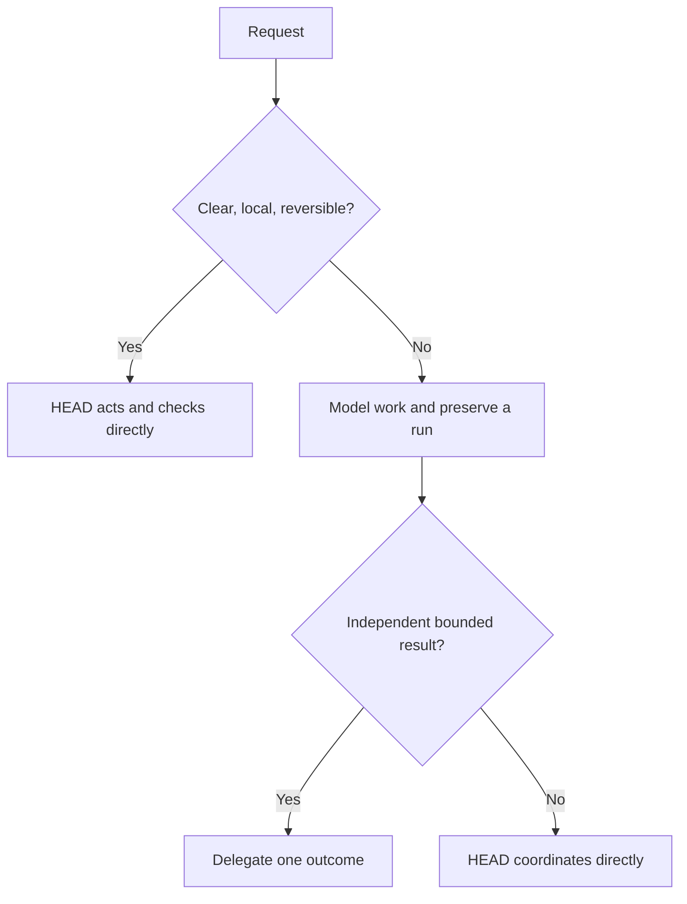

# Small Work Versus Durable Work

[HEAD Agent Core](../../README.md) / [Learn](../README.md) / [Operation](README.md) / Small Work Versus Durable Work

## Learning Objective

Choose enough coordination for the work without turning every request into a durable project.

## Core Claim

Process should scale with coordination and recovery needs. A clear, reversible request may be handled directly; work with multiple dependencies, material decisions, handoffs, or interruption risk needs an explicit model and usually a run canon.

## Design Response

Use the smallest shape that makes completion observable. A run records a durable agreement when the work must survive interruption; delegation is optional and earns its cost only when an owner can carry a coherent result independently.

## Rejected Alternative

Uniform ceremony is easy to teach but inefficient in practice. Treating a one-line correction like a multi-party release creates delay and obscures the real risk. Treating consequential, long-running work like a chat reply loses decisions and recovery state.

## Common Misunderstanding

“Small” does not mean unimportant. A small but irreversible or user-owned decision may still require a pause for direction. “Durable” does not mean delegated; HEAD may retain direct ownership.

## Takeaway

Add ceremony to protect real coordination and recovery needs, not to perform process.

Previous: [Operation](README.md) | Next: [Building The Work Model](building-the-work-model.md)

Source class: current shared principles; operational observation.
