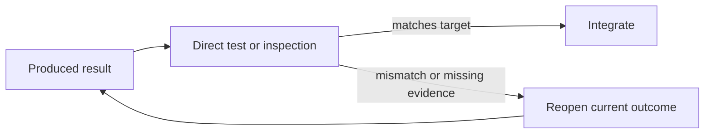

# Verification

[HEAD Agent Core](../../README.md) / [Learn](../README.md) / [Operation](README.md) / Verification

## Learning Objective

Use direct, relevant evidence to decide whether a result is ready to become input to later work.

## Core Claim

Confidence reporting is not verification. A result is checked against the agreed observable behavior, artifact, or state before downstream expansion relies on it.

## Design Response

Define completion evidence while shaping the outcome. The owner self-checks; HEAD verifies that evidence against the full work model. An independent reviewer is useful when separate judgment can materially change a consequential result, not as automatic ceremony.

## Rejected Alternative

“Done,” a status update, or a high confidence score can summarize a claim but cannot demonstrate behavior. Passing an unchecked result downstream compounds omissions and changed assumptions.

## Common Misunderstanding

Verification is not synonymous with a single automated test. The appropriate direct evidence may be a rendered interface, a reviewed document, a measured operation, or a test suite, depending on the target.

## Takeaway

Observe the result against its target before allowing it to expand the next stage.

Previous: [Delegation](delegation.md) | Next: [Integration](integration.md)

Source class: current shared principles; operational observation.
