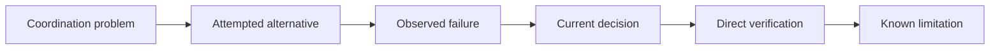

# Decisions: Rejected Alternatives And Trade-Offs

[HEAD Agent Core](../../README.md) / [Learn](../README.md) / Decisions

## Learning Objective

Learn why HEAD Agent Core keeps one resident outcome owner, bounded one-shot workers, outcome-oriented delegation, governed context, durable runs, general rules, and separate verification.

## Core Claim

The architecture is not a collection of defaults. Each current choice is a response to a failure mode in an alternative. The choices have costs, and those costs remain visible.

## Chapter Map

1. [Why Not One Agent?](why-not-one-agent.md)
2. [Why Not An Autonomous Swarm?](why-not-an-autonomous-swarm.md)
3. [Why Workers Are One-Shot](why-workers-are-one-shot.md)
4. [Why Outcomes, Not Step Lists?](why-outcomes-not-step-lists.md)
5. [Why References, Not Context Dumps?](why-references-not-context-dumps.md)
6. [Why Runs, Not Runtime State?](why-runs-not-runtime-state.md)
7. [Why General Rules, Not Deny Lists?](why-general-rules-not-deny-lists.md)
8. [Why Verification Is Separate](why-verification-is-separate.md)

## How To Read This Chapter

Every decision page follows the same sequence: problem, attempted alternative, observed failure, current decision, related theory, and current limitation. Each also labels its evidence type:

| Label | Use in this chapter |
| --- | --- |
| Historical record | What archived design material or repository history records. |
| Operational observation | A repeated operating pattern, not a universal law. |
| Generalized failure | A public-safe illustrative reconstruction. |
| Related theory | A retrospective explanatory lens, not a claim about original intent. |

## Scope

These pages explain design rationale. They do not reproduce operational instructions, private examples, internal measurements, or project-specific contracts. Use the public [Shared Core](../../head/README.md), [Skills](../../skills/README.md), and [Agents](../../agents/README.md) references for current implementation detail.

Previous chapter: [Operation](../08-operation/README.md) | Next: [Why Not One Agent?](why-not-one-agent.md)

Source class: historical record; operational observation; current shared principles; retrospective theory.
