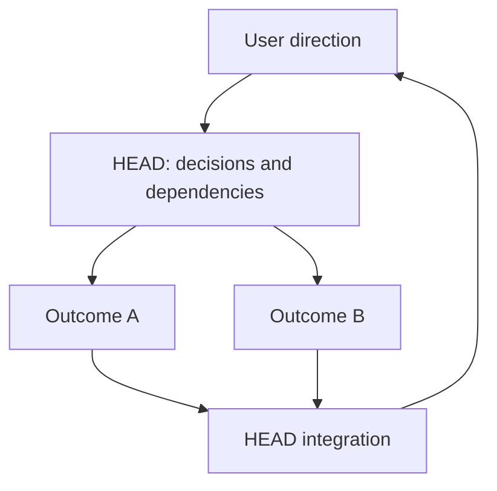

# Why Not An Autonomous Swarm?

[HEAD Agent Core](../../README.md) / [Learn](../README.md) / [Decisions](README.md) / Why Not An Autonomous Swarm?

## Problem

Parallel work can reduce elapsed time, but it can also multiply incompatible assumptions. The system needs speed without distributing user-owned decisions into separate, drifting contexts.

## Attempted Alternative

Let many agents discover tasks, assign work to one another, and coordinate toward a broad goal with minimal central judgment. The appeal is apparent autonomy and maximum parallelism.

## Observed Failure

**Historical record.** Earlier architecture material modeled specialized agents and dependency phases, including parallel work only after stated inputs were available. It did not establish that unbounded peer coordination was reliable.

**Operational observation.** Parallelism is useful only when inputs are ready, outputs compose, and mutation surfaces do not conflict. More active agents do not repair an unresolved decision; they can produce several incompatible answers to it.

**Generalized failure.** Three agents receive a broad request to improve an onboarding flow. Each chooses a different interpretation of success and changes a related surface. Their reports all sound plausible, but their outputs cannot be combined without discarding work and reopening the user decision they each guessed.

## Current Decision

The user talks to HEAD, not to a peer swarm. HEAD builds the work model, resolves or escalates material decisions, and dispatches only bounded outcomes with ready inputs. Independent outcomes may run together; dependent or conflicting outcomes wait. Workers can challenge a framing with evidence, but they do not silently redefine the larger goal.

## Related Theory

**Related theory.** Directed acyclic graph scheduling and decision-rights design explain why work can fan out only after its dependencies and authority are clear. This is retrospective theory, not a claim that a formal scheduler proves every delegation safe.

## Current Limitation

HEAD can become a bottleneck, and its dependency model can be wrong. Some work is genuinely exploratory and cannot be fully specified before investigation. In those cases, HEAD gives a worker a bounded discovery outcome rather than pretending the entire future is known.

## Takeaway

Parallelize independently observable results, not unresolved decisions. A single decision surface keeps expansion downward while preserving user direction.

Previous: [Why Not One Agent?](why-not-one-agent.md) | Next: [Why Workers Are One-Shot](why-workers-are-one-shot.md)

Source class: historical record from archived design material; operational observation; current delegation principles; retrospective theory.
