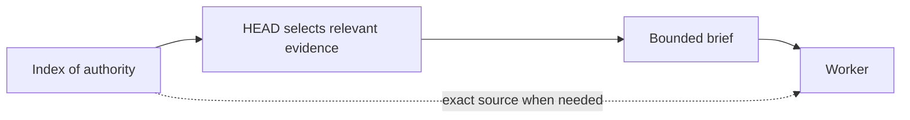

# Why References, Not Context Dumps?

[HEAD Agent Core](../../README.md) / [Learn](../README.md) / [Decisions](README.md) / Why References, Not Context Dumps?

## Problem

An owner needs enough context to make sound local decisions. Giving every owner all available history appears safe, but volume can hide authority, relevance, and recency.

## Attempted Alternative

Copy broad project background, prior failures, generic process rules, and surrounding documents into each worker brief so nothing is missed.

## Observed Failure

**Historical record.** Early design material identified context limits and a desire for focused inputs. Current shared principles direct owners to keep broad knowledge in indexed canonical sources and assemble only the relevant subset.

**Operational observation.** Context is not neutral storage. Irrelevant or conflicting material can distract from the current decision, while copied excerpts become stale and lose their relation to their authority source.

**Generalized failure.** A worker receives a long packet containing old alternatives, unrelated constraints, and the current requirement. It follows an obsolete example because it is concrete and nearby, even though the current source says otherwise.

## Current Decision

Give a worker the smallest complete context: the outcome, locked decisions, authoritative starting inputs, boundary, and completion evidence. Reference broad history and canonical sources instead of duplicating them when the worker can safely inspect the exact source. HEAD retains the wider context needed to select and interpret evidence.

## Related Theory

**Related theory.** Information retrieval, bounded context, and the principle of least information help explain the choice. These lenses do not imply a universal minimum context size; sufficiency depends on the decision being made.

## Current Limitation

A reference can be inaccessible, misunderstood, or too costly to inspect. Over-pruning can force invention just as surely as dumping can cause distraction. HEAD must judge what is complete enough for the bounded outcome and revise that judgment when evidence exposes a gap.

## Takeaway

Send decision-changing context, not a history archive. Preserve authority through references and select the smallest set that lets the owner succeed without guessing.

Previous: [Why Outcomes, Not Step Lists?](why-outcomes-not-step-lists.md) | Next: [Why Runs, Not Runtime State?](why-runs-not-runtime-state.md)

Source class: historical record; operational observation; current shared context principles; retrospective theory.
