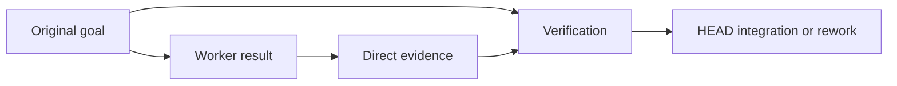

# Why Verification Is Separate

[HEAD Agent Core](../../README.md) / [Learn](../README.md) / [Decisions](README.md) / Why Verification Is Separate

## Problem

A completed action is not necessarily a correct result. Systems need a way to compare the output with the intended outcome before that output becomes input to more work.

## Attempted Alternative

Accept a worker's report, a passing local check, or the producer's confidence as completion. In a stronger version, the same owner executes and declares final success without an independent challenge.

## Observed Failure

**Historical record.** Archived design material called for separate validation after multi-step work. Current architecture keeps direct outcome evidence with execution and reserves independent review for cases where separate judgment can materially affect a consequential result.

**Operational observation.** Producers naturally know what they attempted, which can make it easy to verify activity instead of behavior. A report can be useful evidence, but it cannot silently become the source of truth for the whole outcome.

**Generalized failure.** A worker reports that every requested file changed and a local check passed. Later integration reveals that the changed behavior violates a locked interface decision. The action evidence was real; the outcome evidence was incomplete.

## Current Decision

Build direct evidence into each bounded outcome, then have HEAD verify it against the original goal and integrate it into the larger work model. Add an independent reviewer when the consequence, uncertainty, or novelty justifies a second judgment. Verification is separate in responsibility even when HEAD performs it directly.

## Related Theory

**Related theory.** Separation of duties, test-oracle thinking, and feedback control explain why an observed result should be compared with a target before further expansion. These theories are retrospective and do not make any single check sufficient.

## Current Limitation

Verification can be weak, expensive, or based on the wrong oracle. Independent review can repeat the same misconception or add delay without finding value. The system therefore asks whether a review can materially change the result rather than treating every task as equally risky.

## Takeaway

Treat execution evidence as input to judgment, not automatic completion. Verify the result against the agreed target before relying on it downstream.

Previous: [Why General Rules, Not Deny Lists?](why-general-rules-not-deny-lists.md) | Next chapter: [Evolution](../10-evolution/README.md)

Source class: historical record from archived validation design; operational observation; current completion principles; retrospective theory.
