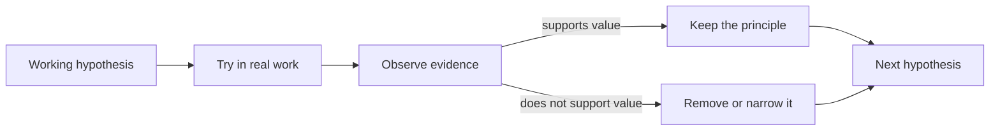

# Evolution: What Evidence Changed

[HEAD Agent Core](../../README.md) / [Learn](../README.md) / Evolution

## Learning Objective

Learn to treat an AI work system as a set of revisable hypotheses, not as a finished architecture waiting to be discovered.

## Core Claim

The present design is a record of constraints that survived contact with evidence. Earlier versions added roles, tools, context, format rules, and recovery machinery for understandable reasons. Later evidence showed where those additions did not deliver their promised value or created new failure modes.

This is not a claim that less machinery is always better. It is a claim that every layer must continue to earn its coordination, context, and maintenance cost.

## Chapter Map

1. [Timeline](timeline.md)
2. [Hypotheses We Rejected](hypotheses-we-rejected.md)
3. [What Survived Testing](what-survived-testing.md)
4. [Simplification After Complexity](simplification-after-complexity.md)
5. [Evidence Boundaries](evidence-boundaries.md)

## How To Read This Chapter

Each page labels claims by source class. **Historical record** identifies evidence in repository history or archived design material. **Operational observation** names a bounded observation from running the system. **Generalized failure** retells a failure without private operational detail. **Related theory** is a later explanatory lens, not a claim about what the builders originally intended.

## Takeaway

An architecture becomes trustworthy not when it has an elegant origin story, but when it visibly changes after contrary evidence.

Previous: [Decisions](../09-decisions/README.md) | Next: [Timeline](timeline.md) | Chapter exit: [Adoption](../11-adoption/README.md)

Source classes: historical record; operational observation; generalized failure; related theory.
