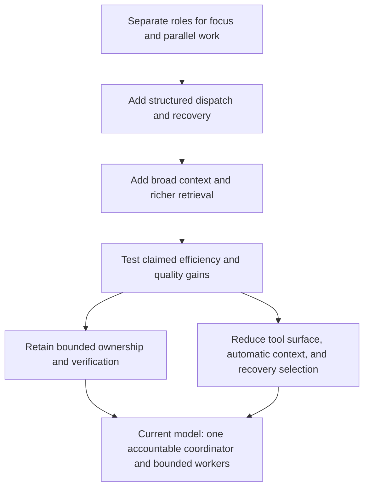

# Timeline

[HEAD Agent Core](../../README.md) / [Learn](../README.md) / [Evolution](README.md) / Timeline

## Core Claim

The system did not move in a straight line from simple to correct. It repeatedly added structure to solve a local problem, then removed or narrowed structure when evidence changed the diagnosis.

## Early Separation

**Historical record.** The early architecture separated work among multiple specialist roles. Its stated aims were focused context, distinct expertise, and parallel work. The same record also preserved a coordinator role that integrated dependent results.

This was a reasonable starting hypothesis: if one long conversation mixes concerns, distributing concerns across specialized owners may improve clarity. It was not yet evidence that every distinct concern needed a durable agent, nor that more concurrent roles improved an outcome.

## Structured Machinery

**Historical record.** Later repository history shows investment in structured dispatch, explicit task state, automated recovery instructions, and increasingly detailed context injection. These measures addressed observed command transport failures, long-context interruption, and ambiguity in worker instructions.

**Generalized failure.** A system can repair a brittle handoff by recording more state and adding more ways to find it again. Each repair appears protective in isolation. Together, the recovery path can become difficult to reason about: several records may disagree, and selecting one becomes an unverified decision.

## The Efficiency Claim Meets Observation

**Operational observation.** Comparative work challenged the claim that a graph-shaped retrieval layer would generally save tokens for code investigation. In the observed cases, direct search could often reach the relevant code without the proposed retrieval overhead. The value that remained was narrower: connecting questions to evidence outside the code and checking a conclusion against authoritative current state when that evidence was necessary.

This changed the lesson from "use a graph first" to "retrieve the evidence that changes the decision."

## Simplification As A Design Result

**Historical record.** Later shared-Core changes replaced rule-heavy guidance with compact principles and replaced a prescriptive planning format with a stable work agreement that permits task-appropriate structure. Current recovery documentation likewise defines a fixed, small authority set rather than recovery-time selection among pointers, snapshots, and fallbacks.

The result was not a return to one undifferentiated conversation. It retained a single accountable coordinator, explicit work models, bounded outcome ownership, direct verification, and a durable agreement for consequential work.

## Retrospective Lens

**Related theory.** This history resembles iterative systems design: hypotheses are made explicit, tested in use, and revised when observed behavior contradicts their expected benefit. The theory describes the pattern; it is not evidence that the historical builders began with that theory.

## Takeaway

Keep the problem-solving intent behind a retired mechanism. It may survive as a smaller rule even when the mechanism does not.

Previous: [Evolution overview](README.md) | Next: [Hypotheses We Rejected](hypotheses-we-rejected.md) | Chapter exit: [Adoption](../11-adoption/README.md)

Source classes: historical record; operational observation; generalized failure; related theory.
